# Builders: Code Generation - Template Delimiters - 17-Fold Division

This document applies a 17-fold division to the 'Delimiters' facet of 'Syntax' under the 'Builders' archetype, providing a deeper level of granularity for the characters or sequences that mark the beginning and end of template tags or expressions.

## 1. Opening Delimiter

The character or sequence of characters that marks the start of a template block, tag, or expression.

## 2. Closing Delimiter

The character or sequence of characters that marks the end of a template block, tag, or expression.

## 3. Variable Delimiters

Specific delimiters used exclusively for outputting variable values or expressions (e.g., `{{ variable }}`).

## 4. Tag Delimiters

Delimiters used for control flow statements, logic blocks, or other non-outputting template tags (e.g., ``).

## 5. Comment Delimiters

Delimiters specifically for marking comments within the template code that should not be rendered in the output (e.g., `{# comment #}`).

## 6. Raw/Literal Delimiters

Delimiters that define a block of content where the template engine should not parse or interpret any template syntax within it.

## 7. Whitespace Control Delimiters

Special characters or modifiers within delimiters that instruct the template engine to strip leading or trailing whitespace around the tag.

## 8. Escaping Delimiters

How the delimiters themselves can be escaped or rendered as literal text if they appear within the content that needs to be outputted.

## 9. Nesting Rules

How different types of delimiters or template blocks behave when nested within each other, and the rules governing their parsing order.

## 10. Context Sensitivity

Whether the interpretation or validity of a delimiter changes based on the specific context or state within the template parsing process.

## 11. Customization

The ability for users or developers to define, change, or configure the default delimiters used by the template engine.

## 12. Readability

How the chosen delimiters impact the overall readability and visual clarity of the template code, making it easier to distinguish logic from content.

## 13. Conflict Avoidance

Choosing delimiters that are unlikely to appear naturally in the generated content or the surrounding text, to prevent parsing errors.

## 14. IDE Support

How well Integrated Development Environments (IDEs) recognize, highlight, and provide auto-completion or syntax checking for the chosen delimiters.

## 15. Error Handling

How the template engine reports and handles mismatched, missing, or incorrectly used delimiters during parsing or rendering.

## 16. Performance Impact

The overhead associated with parsing and recognizing different delimiter types, especially in complex templates or high-throughput scenarios.

## 17. Security Implications

How delimiters might be exploited in template injection attacks, and measures to prevent such vulnerabilities.

---

## Visual Representation (Mermaid Diagram)

```mermaid
graph TD
    A[Builders: Delimiters] --> B(1. Opening Delimiter)
    A --> C(2. Closing Delimiter)
    A --> D(3. Variable Delimiters)
    A --> E(4. Tag Delimiters)
    A --> F(5. Comment Delimiters)
    A --> G(6. Raw/Literal Delimiters)
    A --> H(7. Whitespace Control Delimiters)
    A --> I(8. Escaping Delimiters)
    A --> J(9. Nesting Rules)
    A --> K(10. Context Sensitivity)
    A --> L(11. Customization)
    A --> M(12. Readability)
    A --> N(13. Conflict Avoidance)
    A --> O(14. IDE Support)
    A --> P(15. Error Handling)
    A --> Q(16. Performance Impact)
    A --> R(17. Security Implications)
```

