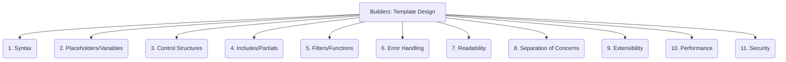

# Builders: Code Generation - Template Design - 11-Fold Division

This document applies an 11-fold division to the 'Template Design' facet of 'Code Generation' under the 'Builders' archetype, providing a deeper level of granularity for creating reusable patterns or structures for generated code.

## 1. Syntax

The specific language or format used for writing templates (e.g., Jinja2, Handlebars, Liquid, Go templates, ERB), defining how dynamic content is expressed.

## 2. Placeholders/Variables

How dynamic content, data, or parameters are represented within the template, to be replaced during the generation process.

## 3. Control Structures

Conditional logic (e.g., `if/else`), loops (`for/each`), and other flow control mechanisms that dictate how parts of the template are rendered.

## 4. Includes/Partials

Mechanisms for reusing template fragments or smaller template files within larger templates, promoting modularity and consistency.

## 5. Filters/Functions

Operations or transformations that can be applied to variables or content within the template (e.g., formatting dates, escaping HTML, string manipulation).

## 6. Error Handling

How template rendering errors (e.g., missing variables, syntax errors) are managed, reported, and potentially displayed to the user.

## 7. Readability

Designing templates that are easy to understand, follow, and maintain, often through clear structure, consistent indentation, and meaningful naming.

## 8. Separation of Concerns

Ensuring that presentation logic within the template is kept separate from business logic or data retrieval, promoting cleaner codebases.

## 9. Extensibility

How easily new features, custom logic, or specialized rendering capabilities can be added to the template engine or template language.

## 10. Performance

Optimizing templates for fast rendering, minimizing computational overhead, and efficient resource utilization during code generation.

## 11. Security

Preventing template injection vulnerabilities, cross-site scripting (XSS), or other security risks that can arise from rendering untrusted data in templates.

---

## Visual Representation (Mermaid Diagram)

