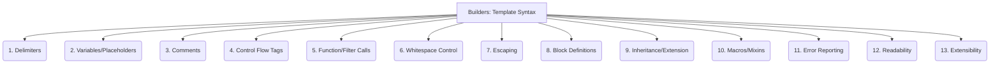

# Builders: Code Generation - Template Syntax - 13-Fold Division

This document applies a 13-fold division to the 'Syntax' facet of 'Template Design' under the 'Builders' archetype, providing a deeper level of granularity for the specific language or format used for writing templates.

## 1. Delimiters

Characters or sequences that mark the beginning and end of template tags, expressions, or control structures (e.g., `{{`, `}}`, ``).

## 2. Variables/Placeholders

How dynamic data or parameters are referenced and displayed within the template, to be replaced during the rendering process.

## 3. Comments

Syntax for adding non-rendered notes or explanations within the template code, aiding readability and maintenance.

## 4. Control Flow Tags

Syntax for conditional statements (e.g., `if/else`, `unless`) and looping constructs (e.g., `for/each`, `while`) to control template rendering logic.

## 5. Function/Filter Calls

How built-in or custom functions, filters, or transformations are applied to variables or content within the template (e.g., `{{ variable | filter_name }}`).

## 6. Whitespace Control

Syntax or mechanisms for managing whitespace in the rendered output, preventing unwanted newlines or spaces from template code.

## 7. Escaping

How special characters (e.g., HTML entities) are handled to prevent unintended rendering, cross-site scripting (XSS), or injection vulnerabilities.

## 8. Block Definitions

Syntax for defining reusable blocks or sections within a template that can be overridden or extended by child templates.

## 9. Inheritance/Extension

How templates can extend or inherit from other base templates, promoting code reuse and consistent layouts.

## 10. Macros/Mixins

Defining reusable snippets of template logic or components that can be invoked with parameters, similar to functions in programming languages.

## 11. Error Reporting

How syntax errors, rendering failures, or missing data are indicated within the template or during the generation process.

## 12. Readability

Design choices and conventions that make the template syntax easy to read, understand, and debug for developers.

## 13. Extensibility

How new syntax elements, custom tags, filters, or functions can be added to the template language or engine to meet specific project needs.

---

## Visual Representation (Mermaid Diagram)

