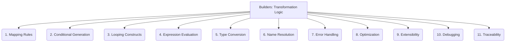

# Builders: Code Generation - Transformation Logic - 11-Fold Division

This document applies an 11-fold division to the 'Transformation Logic' facet of 'Code Generation' under the 'Builders' archetype, providing a deeper level of granularity for the rules and algorithms that convert input into code.

## 1. Mapping Rules

Defining how elements, attributes, or relationships in the input model or specification are translated into specific code constructs in the target language.

## 2. Conditional Generation

Generating different code blocks or structures based on specific conditions, flags, or values present in the input data or model.

## 3. Looping Constructs

Generating repetitive code blocks (e.g., iterating over collections, creating multiple similar components) based on iterative structures in the input.

## 4. Expression Evaluation

Evaluating expressions, calculations, or logical statements within the input model to produce values that are then used in the generated code.

## 5. Type Conversion

Handling data type conversions and compatibility between the input model's data types and the target programming language's type system.

## 6. Name Resolution

Resolving references, ensuring unique names, and managing naming conflicts in the generated code, often based on predefined rules or patterns.

## 7. Error Handling

How the transformation logic manages and reports errors, warnings, or inconsistencies encountered during the code generation process.

## 8. Optimization

Applying rules or algorithms to generate efficient, performant, or optimized code, considering factors like resource usage or execution speed.

## 9. Extensibility

How new transformation rules, custom logic, or specialized generation capabilities can be added to the code generator.

## 10. Debugging

Tools and techniques for understanding, tracing, and troubleshooting the transformation process to identify issues in the generated code or the logic itself.

## 11. Traceability

Linking generated code elements back to the specific input elements, rules, or models that produced them, enabling understanding of the code's origin.

---

## Visual Representation (Mermaid Diagram)

