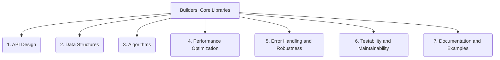

# Builders: Core Libraries - 7-Fold Division

This document applies the 7-fold division of the Heptad to the 'Core Libraries' thematic group under the 'Builders' archetype, providing a deeper level of granularity for the fundamental building blocks of the system.

## 1. API Design

The structure, consistency, and usability of the library's public interfaces, ensuring ease of integration and developer experience.

## 2. Data Structures

The fundamental ways data is organized, stored, and managed within the library, impacting efficiency and functionality.

## 3. Algorithms

The computational procedures, logical steps, and problem-solving methods implemented by the library to achieve its core functionalities.

## 4. Performance Optimization

Techniques and strategies employed to ensure the library operates efficiently, quickly, and with minimal resource consumption.

## 5. Error Handling and Robustness

How the library manages, reports, and recovers from unexpected conditions, invalid inputs, or failures, ensuring stability.

## 6. Testability and Maintainability

Design choices and practices that facilitate easy and comprehensive testing, as well as future modifications, extensions, and bug fixes.

## 7. Documentation and Examples

The clarity, completeness, and accessibility of guides, tutorials, and illustrative examples for effectively using and understanding the library.

---

## Visual Representation (Mermaid Diagram)

