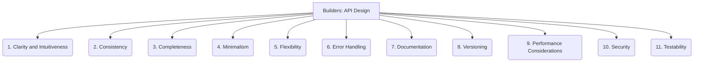

# Builders: Core Libraries - API Design - 11-Fold Division

This document applies an 11-fold division to the 'API Design' facet of 'Core Libraries' under the 'Builders' archetype, providing a deeper level of granularity for designing the public interfaces of a library.

## 1. Clarity and Intuitiveness

How easy it is for developers to understand, learn, and use the API without extensive documentation or prior knowledge.

## 2. Consistency

Uniformity in naming conventions, parameter order, data types, and error handling across all parts of the API.

## 3. Completeness

Providing all necessary functionalities and operations for the intended use cases, without missing critical features.

## 4. Minimalism

Avoiding unnecessary features, complexity, or over-engineering, focusing on providing essential functionality efficiently.

## 5. Flexibility

Designing the API to accommodate various use cases, different programming paradigms, and future extensions without major rework.

## 6. Error Handling

How the API communicates errors, exceptions, and invalid states to the client, allowing for graceful recovery and debugging.

## 7. Documentation

Clear, comprehensive, and up-to-date guides, examples, tutorials, and reference materials for using the API effectively.

## 8. Versioning

Managing changes to the API over time, ensuring backward compatibility where possible, and providing clear upgrade paths for clients.

## 9. Performance Considerations

Designing the API to be efficient, responsive, and to minimize resource consumption, especially for high-throughput or low-latency scenarios.

## 10. Security

Protecting the API from unauthorized access, misuse, and vulnerabilities, including authentication, authorization, and input validation.

## 11. Testability

Designing the API to be easily testable in isolation, allowing for robust unit, integration, and end-to-end testing.

---

## Visual Representation (Mermaid Diagram)

