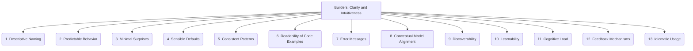

# Builders: Core Libraries - API Design - Clarity and Intuitiveness - 13-Fold Division

This document applies a 13-fold division to the 'Clarity and Intuitiveness' facet of 'API Design' under the 'Builders' archetype, providing a deeper level of granularity for how easy it is for developers to understand and use a library's public interfaces.

## 1. Descriptive Naming

Using clear, unambiguous, and self-explanatory names for functions, parameters, types, and variables, reflecting their purpose and behavior.

## 2. Predictable Behavior

Ensuring that API calls consistently produce expected results, without unexpected side effects or hidden complexities.

## 3. Minimal Surprises

Avoiding unexpected side effects, hidden dependencies, or non-obvious behaviors that can lead to developer frustration or bugs.

## 4. Sensible Defaults

Providing reasonable and safe default values for optional parameters, reducing the need for explicit configuration in common use cases.

## 5. Consistent Patterns

Adhering to established design patterns, conventions, and idioms within the API and the broader ecosystem, making it familiar to developers.

## 6. Readability of Code Examples

Providing clear, concise, and easy-to-understand code snippets and examples that demonstrate common API usage scenarios.

## 7. Error Messages

Providing informative, actionable, and developer-friendly error messages that help diagnose and resolve issues quickly.

## 8. Conceptual Model Alignment

How well the API's structure, naming, and behavior map to the real-world problem domain it addresses, making it intuitive to reason about.

## 9. Discoverability

How easily developers can find and understand API functionalities, often through good documentation, IDE support, and consistent design.

## 10. Learnability

The effort required for a new developer to become proficient with the API, including its core concepts, common patterns, and advanced features.

## 11. Cognitive Load

Minimizing the mental effort and cognitive burden required for developers to understand, use, and remember the API's functionalities.

## 12. Feedback Mechanisms

How the API communicates its state, progress, and potential issues to the developer, providing timely and clear indications.

## 13. Idiomatic Usage

Designing the API to feel natural and familiar within the target programming language or ecosystem, adhering to its conventions and best practices.

---

## Visual Representation (Mermaid Diagram)

