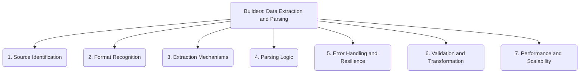

# Builders: Data Extraction and Parsing - 7-Fold Division

This document applies the 7-fold division of the Heptad to the 'Data Extraction and Parsing' thematic group under the 'Builders' archetype, providing a deeper level of granularity for how data is extracted and parsed.

## 1. Source Identification

Locating and accessing the raw data sources, which can include files, APIs, web pages, databases, or other repositories.

## 2. Format Recognition

Identifying the structure, encoding, and syntax of the data (e.g., JSON, XML, CSV, plain text, binary) to apply appropriate parsing methods.

## 3. Extraction Mechanisms

The specific methods and tools used to pull or retrieve data from the identified sources, such as regex, XPath, API calls, or web scraping.

## 4. Parsing Logic

The rules, algorithms, and grammars applied to transform the raw extracted data into structured, machine-readable formats.

## 5. Error Handling and Resilience

How the extraction and parsing process manages and recovers from malformed data, missing fields, unexpected input, or source unavailability.

## 6. Validation and Transformation

Ensuring the quality, integrity, and correctness of the extracted data, and converting it into a standardized or usable format for downstream processes.

## 7. Performance and Scalability

Optimizing the extraction and parsing process to efficiently handle large volumes of data, high throughput, and varying data complexities.

---

## Visual Representation (Mermaid Diagram)

