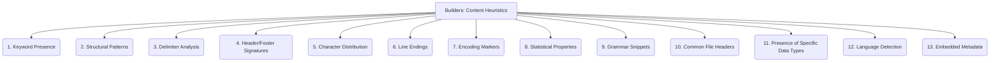

# Builders: Data Extraction and Parsing - Content Heuristics - 13-Fold Division

This document applies a 13-fold division to the 'Content Heuristics' facet of 'Format Recognition' under the 'Builders' archetype, providing a deeper level of granularity for analyzing content structure to identify its format.

## 1. Keyword Presence

Looking for specific keywords or phrases that are highly indicative of a particular format (e.g., `<html`, `<?xml version=`, `function`, `SELECT FROM`).

## 2. Structural Patterns

Identifying recurring patterns in the data's arrangement, such as the presence of curly braces (`{...}`), square brackets (`[...]`), angle brackets (`<tag>...</tag>`), or specific indentation.

## 3. Delimiter Analysis

Detecting common delimiters used in tabular or structured data, such as commas, tabs, semicolons, or pipe characters, to infer CSV-like formats.

## 4. Header/Footer Signatures

Recognizing specific strings or byte sequences that typically appear at the beginning or end of a file for certain formats (e.g., PDF magic number, JPEG JFIF header).

## 5. Character Distribution

Analyzing the frequency and distribution of different characters (e.g., a high percentage of printable ASCII characters for text, or specific byte ranges for binary data).

## 6. Line Endings

Detecting common line ending conventions (e.g., CRLF for Windows, LF for Unix/Linux, CR for old Mac) to infer text file types.

## 7. Encoding Markers

Looking for Byte Order Marks (BOMs) at the beginning of text files or explicit encoding declarations within the content (e.g., `charset=UTF-8`).

## 8. Statistical Properties

Analyzing statistical properties of the data, such as entropy (for compressed or encrypted data), character n-gram frequencies, or byte value distributions.

## 9. Grammar Snippets

Attempting to parse small, characteristic portions of the content against known grammar rules for specific languages or formats (e.g., JSON object start, XML declaration).

## 10. Common File Headers

Recognizing common headers or introductory lines for specific file types that are not necessarily magic numbers but are conventional (e.g., `#!/bin/bash` for shell scripts).

## 11. Presence of Specific Data Types

Detecting patterns that strongly suggest the presence of specific data types, such as ISO-formatted dates, email addresses, URLs, or numerical sequences.

## 12. Language Detection

Inferring the human language of text content, which can sometimes provide clues about the document's origin or intended use.

## 13. Embedded Metadata

Extracting metadata embedded within the file (e.g., EXIF data in images, ID3 tags in audio files, document properties in office files) that might indicate the format or content type.

---

## Visual Representation (Mermaid Diagram)

