# Builders: Data Extraction and Parsing - Keyword Presence - 17-Fold Division

This document applies a 17-fold division to the 'Keyword Presence' facet of 'Content Heuristics' under the 'Builders' archetype, providing a deeper level of granularity for searching for specific keywords or phrases indicative of a format or content type.

## 1. Exact Match

Searching for an exact string or phrase, where the keyword must appear precisely as specified.

## 2. Case Sensitivity

Whether the search for keywords distinguishes between uppercase and lowercase letters.

## 3. Regular Expressions

Using patterns (regex) to match variations of keywords, allowing for flexible and powerful search criteria.

## 4. Stemming/Lemmatization

Matching different morphological forms of a word (e.g., "run," "running," "ran") to a common base form.

## 5. Synonyms

Including alternative words or phrases with similar meanings to broaden the search results.

## 6. Proximity Search

Finding keywords that appear within a certain distance or number of words from each other within the text.

## 7. Boolean Operators

Combining keywords using logical operators such as AND, OR, and NOT to refine search queries.

## 8. Wildcard Search

Using special characters (e.g., `*`, `?`) to match partial words or varying character sequences.

## 9. Stop Words

Ignoring common words (e.g., "the," "a," "is") that typically do not add significant meaning to a search query.

## 10. N-gram Analysis

Identifying and matching sequences of words or characters (n-grams) to capture phrases and contextual patterns.

## 11. Domain-Specific Dictionaries

Using curated lists of keywords, terms, or jargon relevant to a particular domain or industry to improve search accuracy.

## 12. Weighted Keywords

Assigning different importance levels or scores to keywords, influencing the relevance of search results.

## 13. Contextual Keywords

Keywords whose meaning or relevance changes based on the surrounding words or the overall context of the text.

## 14. Negative Keywords

Specifying words or phrases that should *not* be present in the search results, to exclude irrelevant content.

## 15. Fuzzy Matching

Allowing for minor spelling errors, typos, or variations in keywords to find approximate matches.

## 16. Phonetic Matching

Matching words that sound similar, often used in voice search or when dealing with transcribed audio.

## 17. Semantic Search

Understanding the meaning and intent behind the keywords, rather than just literal matches, to retrieve conceptually related content.

---

## Visual Representation (Mermaid Diagram)

```mermaid
graph TD
    A[Builders: Keyword Presence] --> B(1. Exact Match)
    A --> C(2. Case Sensitivity)
    A --> D(3. Regular Expressions)
    A --> E(4. Stemming/Lemmatization)
    A --> F(5. Synonyms)
    A --> G(6. Proximity Search)
    A --> H(7. Boolean Operators)
    A --> I(8. Wildcard Search)
    A --> J(9. Stop Words)
    A --> K(10. N-gram Analysis)
    A --> L(11. Domain-Specific Dictionaries)
    A --> M(12. Weighted Keywords)
    A --> N(13. Contextual Keywords)
    A --> O(14. Negative Keywords)
    A --> P(15. Fuzzy Matching)
    A --> Q(16. Phonetic Matching)
    A --> R(17. Semantic Search)
```

