# Builders: Data Extraction and Parsing - Query Parameters - 17-Fold Division

This document applies a 17-fold division to the 'Query Parameters' facet of 'Web URLs' under the 'Builders' archetype, providing a deeper level of granularity for understanding and handling dynamic data in web requests.

## 1. Key-Value Pairs

The fundamental structure of query parameters, consisting of a parameter name (key) and its associated value.

## 2. Separators

How multiple parameters are separated within the query string (typically using an ampersand `&`) and how keys and values are separated (typically using an equals sign `=`).

## 3. Encoding

How special characters in parameter keys and values are converted into a URL-safe format (e.g., URL encoding, percent-encoding).

## 4. Order

Whether the sequence of parameters in the query string matters for the server-side application's interpretation or processing.

## 5. Optional vs. Required

Whether a parameter must be present in the query string for the request to be valid, or if it can be omitted.

## 6. Default Values

Predefined values that a server-side application uses for a parameter if it is omitted from the query string.

## 7. Data Types

The expected type of data for a parameter (e.g., string, integer, boolean, array), influencing how it's parsed and validated.

## 8. Validation Rules

Constraints or rules applied to parameter values (e.g., minimum/maximum length, allowed character sets, regular expression patterns) to ensure data integrity.

## 9. Dynamic Generation

How query parameters are created or modified on the client-side (e.g., based on user input, form submissions, JavaScript logic).

## 10. Server-Side Processing

How parameters are interpreted, parsed, validated, and used by the web server or application logic to generate dynamic content or perform actions.

## 11. Security Concerns

Vulnerabilities associated with query parameters, such as SQL injection, Cross-Site Scripting (XSS), information leakage, or parameter tampering.

## 12. Caching Implications

How the presence or specific values of query parameters affect web caching mechanisms, potentially leading to cache misses or stale content.

## 13. SEO Impact

How query parameters influence search engine optimization, including issues like duplicate content, crawl budget, and indexability.

## 14. Tracking and Analytics

Using specific query parameters (e.g., UTM parameters) for user tracking, campaign attribution, and web analytics.

## 15. Pagination

Parameters used to control the display of large datasets, such as `page`, `limit`, `offset`, or `pageSize`.

## 16. Filtering and Sorting

Parameters used to refine search results, apply filters, or specify the order in which data should be presented (e.g., `category`, `sort_by`, `order`).

## 17. Version Control

How changes to expected query parameters, their meanings, or their validation rules are managed and communicated over time, especially in API development.

---

## Visual Representation (Mermaid Diagram)

```mermaid
graph TD
    A[Builders: Query Parameters] --> B(1. Key-Value Pairs)
    A --> C(2. Separators)
    A --> D(3. Encoding)
    A --> E(4. Order)
    A --> F(5. Optional vs. Required)
    A --> G(6. Default Values)
    A --> H(7. Data Types)
    A --> I(8. Validation Rules)
    A --> J(9. Dynamic Generation)
    A --> K(10. Server-Side Processing)
    A --> L(11. Security Concerns)
    A --> M(12. Caching Implications)
    A --> N(13. SEO Impact)
    A --> O(14. Tracking and Analytics)
    A --> P(15. Pagination)
    A --> Q(16. Filtering and Sorting)
    A --> R(17. Version Control)
```

