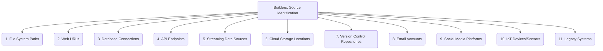

# Builders: Data Extraction and Parsing - Source Identification - 11-Fold Division

This document applies an 11-fold division to the 'Source Identification' facet of 'Data Extraction and Parsing' under the 'Builders' archetype, providing a deeper level of granularity for locating and accessing raw data sources.

## 1. File System Paths

Locating data within local, networked, or distributed file systems, specifying directories and file names.

## 2. Web URLs

Identifying data available on the internet, including websites, web pages, downloadable files, or publicly accessible APIs.

## 3. Database Connections

Specifying database types, hosts, ports, credentials, and schemas for accessing structured data stored in databases.

## 4. API Endpoints

Defining specific URLs, request methods (GET, POST), parameters, and authentication mechanisms for accessing data through Application Programming Interfaces.

## 5. Streaming Data Sources

Identifying real-time data feeds, message queues (e.g., Kafka, RabbitMQ), or event streams for continuous data ingestion.

## 6. Cloud Storage Locations

Specifying buckets, containers, objects, or other storage units within cloud storage services (e.g., AWS S3, Google Cloud Storage, Azure Blob Storage).

## 7. Version Control Repositories

Extracting data directly from Git, SVN, Mercurial, or other version control systems, including historical versions of files.

## 8. Email Accounts

Accessing data from email inboxes, specific mailboxes, or archived email systems for content extraction.

## 9. Social Media Platforms

Identifying and accessing data from social media feeds, user profiles, public posts, or platform-specific APIs.

## 10. IoT Devices/Sensors

Locating and connecting to data streams originating from Internet of Things devices, sensors, or embedded systems.

## 11. Legacy Systems

Identifying and accessing data from older, potentially proprietary, or custom-built systems that may require specialized connectors or protocols.

---

## Visual Representation (Mermaid Diagram)

