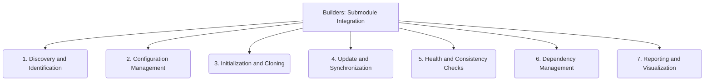

# Builders: Submodule Integration - 7-Fold Division

This document applies the 7-fold division of the Heptad to the 'Submodule Integration' thematic group under the 'Builders' archetype, providing a deeper level of granularity for the process of integrating external submodules.

## 1. Discovery and Identification

Methods and processes for locating, recognizing, and cataloging submodules within a larger repository structure.

## 2. Configuration Management

How submodule paths, URLs, branches, and other settings are defined, stored, and maintained, ensuring consistent setup.

## 3. Initialization and Cloning

The procedures and mechanisms for setting up and retrieving the content of submodules, making them available in the working directory.

## 4. Update and Synchronization

Mechanisms for keeping submodules aligned with their upstream repositories, including fetching new commits and updating references.

## 5. Health and Consistency Checks

Processes for verifying the integrity, correctness, and consistency of submodule states, identifying discrepancies or issues.

## 6. Dependency Management

How submodules contribute to and are managed within the overall project's dependency graph, including versioning and resolution.

## 7. Reporting and Visualization

Methods for presenting the status, relationships, and health of integrated submodules, often through reports or graphical representations.

---

## Visual Representation (Mermaid Diagram)

