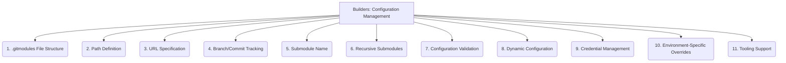

# Builders: Submodule Integration - Configuration Management - 11-Fold Division

This document applies an 11-fold division to the 'Configuration Management' facet of 'Submodule Integration' under the 'Builders' archetype, providing a deeper level of granularity for how submodule configurations are defined and maintained.

## 1. `.gitmodules` File Structure

Understanding the format, fields, and syntax within the `.gitmodules` file, which defines the project's submodules.

## 2. Path Definition

How the local path where the submodule will be cloned is specified, relative to the superproject's root directory.

## 3. URL Specification

Defining the remote repository URL for the submodule, indicating where its source code can be fetched from.

## 4. Branch/Commit Tracking

Specifying whether the submodule should track a particular branch (and update automatically) or a specific commit (fixed reference).

## 5. Submodule Name

The unique identifier or logical name assigned to the submodule within the superproject's configuration.

## 6. Recursive Submodules

Handling nested submodules, where a submodule itself contains other submodules, and managing their configurations recursively.

## 7. Configuration Validation

Ensuring the `.gitmodules` file is well-formed, consistent, and adheres to expected patterns, preventing configuration errors.

## 8. Dynamic Configuration

Methods for programmatically updating, modifying, or generating submodule configurations based on environmental factors or build processes.

## 9. Credential Management

How access credentials (e.g., SSH keys, tokens) for private submodules are securely handled and provided during cloning or updating.

## 10. Environment-Specific Overrides

Allowing different submodule configurations (e.g., different URLs for development vs. production) based on the current environment.

## 11. Tooling Support

How various Git commands, build tools, and CI/CD pipelines interact with and manage submodule configurations.

---

## Visual Representation (Mermaid Diagram)

