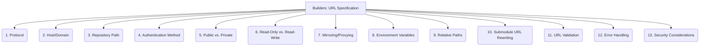

# Builders: Submodule Integration - URL Specification - 13-Fold Division

This document applies a 13-fold division to the 'URL Specification' facet of 'Configuration Management' under the 'Builders' archetype, providing a deeper level of granularity for defining the remote source of a submodule.

## 1. Protocol

Specifying the network protocol used to access the repository (e.g., `https://`, `git://`, `ssh://`, `file://`), determining the communication method.

## 2. Host/Domain

The server address or domain name where the Git repository is hosted, indicating its network location.

## 3. Repository Path

The specific path to the Git repository on the host, identifying the exact location of the codebase.

## 4. Authentication Method

How access to the repository is secured, including methods like username/password, SSH keys, personal access tokens, or OAuth.

## 5. Public vs. Private

Whether the repository is publicly accessible to anyone or requires specific authentication and authorization for access.

## 6. Read-Only vs. Read-Write

The type of access granted by the URL, determining if only fetching is allowed or if pushing changes is also possible.

## 7. Mirroring/Proxying

Using local mirrors or proxy servers to cache repository content, potentially for faster access, security, or compliance reasons.

## 8. Environment Variables

Utilizing environment variables to dynamically set parts of the URL, allowing for flexible configuration across different environments.

## 9. Relative Paths

Specifying submodule URLs relative to the superproject's repository, useful for monorepos or tightly coupled projects.

## 10. Submodule URL Rewriting

Mechanisms or tools that allow for changing or rewriting submodule URLs, often used for internal network routing or security policies.

## 11. URL Validation

Ensuring the provided URL is well-formed, syntactically correct, and points to a valid and accessible Git repository.

## 12. Error Handling

How the system responds to invalid, inaccessible, or malformed URLs during submodule operations, providing informative feedback.

## 13. Security Considerations

Protecting sensitive URL information (e.g., embedded credentials) and preventing unauthorized access or manipulation of submodule sources.

---

## Visual Representation (Mermaid Diagram)

