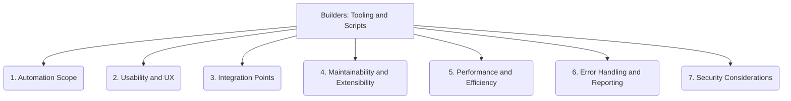

# Builders: Tooling and Scripts - 7-Fold Division

This document applies the 7-fold division of the Heptad to the 'Tooling and Scripts' thematic group under the 'Builders' archetype, providing a deeper level of granularity for the development and use of tools and scripts.

## 1. Automation Scope

The range of tasks, processes, or workflows that the tool or script is designed to automate, defining its functional boundaries.

## 2. Usability and UX

How easy, intuitive, and efficient the tool or script is for its target users, encompassing its interface and overall user experience.

## 3. Integration Points

How the tool or script connects with, interacts with, or leverages other systems, APIs, or existing workflows within the project ecosystem.

## 4. Maintainability and Extensibility

The ease with which the tool or script can be updated, debugged, modified, or expanded to accommodate new requirements or changes.

## 5. Performance and Efficiency

The speed, resource consumption, and overall effectiveness of the tool or script in executing its intended functions.

## 6. Error Handling and Reporting

How the tool or script manages, communicates, and logs errors, warnings, or unexpected conditions during its operation.

## 7. Security Considerations

Measures, practices, and design choices implemented to ensure the tool or script operates securely and protects sensitive data or systems.

---

## Visual Representation (Mermaid Diagram)

