# Builders: Tooling and Scripts - Bug Reporting Workflow - 19-Fold Division

This document applies a 19-fold division to the 'Bug Reporting Workflow' facet of 'Community Support Integration' under the 'Builders' archetype, providing a deeper level of granularity for understanding and optimizing the process of reporting and resolving bugs.

## 1. Entry Points

Where users can submit bug reports (e.g., issue tracker, forum, email), ensuring accessibility and ease of submission.

## 2. Submission Form/Template

Structured fields and templates to guide users in providing necessary information, ensuring consistency and completeness of reports.

## 3. Required Information

Minimum data needed for a valid bug report, such as steps to reproduce, environment details, and expected vs. actual behavior.

## 4. Severity/Priority Levels

Categorization of bugs based on their impact on users and urgency of resolution, guiding triage and resource allocation.

## 5. Reproducibility Steps

Clear, concise, and actionable instructions for developers to consistently replicate the bug, crucial for diagnosis.

## 6. Expected vs. Actual Behavior

Explicitly stating what should happen and what does happen, highlighting the deviation that constitutes the bug.

## 7. Environment Details

Information about the operating system, browser, tool version, dependencies, and other relevant environmental factors where the bug occurs.

## 8. Attachments/Screenshots/Videos

Visual aids and supplementary files provided by the reporter to demonstrate the bug and provide additional context.

## 9. Automated Checks

Initial validation of the report, such as checking for duplicates, verifying format, or performing basic sanity checks.

## 10. Initial Triage

First pass review by maintainers or a triage team to categorize, validate, assign, and prioritize the bug report.

## 11. Communication with Reporter

Keeping the reporter updated on the bug's status, asking for clarification, and confirming resolution, fostering engagement.

## 12. Developer Assignment

Assigning the bug to a specific developer or team for investigation, diagnosis, and resolution.

## 13. Investigation and Diagnosis

The process of analyzing the bug report, reproducing the issue, and understanding the root cause of the defect.

## 14. Fix Implementation

Developing and testing the code changes required to resolve the bug, adhering to coding standards and best practices.

## 15. Verification

Confirming that the bug is resolved, either by the original reporter, a QA team, or automated tests, before closure.

## 16. Closure

Marking the bug report as resolved and closing it in the issue tracking system, often with a summary of the resolution.

## 17. Regression Testing

Ensuring that the bug fix does not introduce new issues or reintroduce previously fixed bugs, maintaining system stability.

## 18. Knowledge Base Integration

Documenting the bug, its root cause, and its solution in a knowledge base for future reference, learning, and faster resolution of similar issues.

## 19. Metrics and Analysis

Tracking bug trends, resolution times, common issues, and other metrics to identify areas for process improvement and proactive quality efforts.

---

## Visual Representation (Mermaid Diagram)

```mermaid
graph TD
    A[Builders: Bug Reporting Workflow] --> B(1. Entry Points)
    A --> C(2. Submission Form/Template)
    A --> D(3. Required Information)
    A --> E(4. Severity/Priority Levels)
    A --> F(5. Reproducibility Steps)
    A --> G(6. Expected vs. Actual Behavior)
    A --> H(7. Environment Details)
    A --> I(8. Attachments/Screenshots/Videos)
    A --> J(9. Automated Checks)
    A --> K(10. Initial Triage)
    A --> L(11. Communication with Reporter)
    A --> M(12. Developer Assignment)
    A --> N(13. Investigation and Diagnosis)
    A --> O(14. Fix Implementation)
    A --> P(15. Verification)
    A --> Q(16. Closure)
    A --> R(17. Regression Testing)
    A --> S(18. Knowledge Base Integration)
    A --> T(19. Metrics and Analysis)
```

