# Builders: Tooling and Scripts - Community Support Integration - 17-Fold Division

This document applies a 17-fold division to the 'Community Support Integration' facet of 'Help and Documentation' under the 'Builders' archetype, providing a deeper level of granularity for understanding how community support is integrated.

## 1. Forum/Discussion Board Links

Direct links to official or community-run forums and discussion boards where users can ask questions and share knowledge.

## 2. Chat/Instant Messaging Channels

Integration with real-time communication platforms like Slack, Discord, or Gitter for immediate support and community interaction.

## 3. Issue Tracker Integration

How community-reported issues, bugs, and feature requests are linked to and managed within the project's development issue tracker.

## 4. Contribution Guidelines

Clear and comprehensive instructions for how users can contribute to the project, including code, documentation, and other assets.

## 5. Code of Conduct

A document outlining expected behavior and fostering a welcoming and inclusive environment within the project community.

## 6. Moderation Policies

Rules and procedures for managing community interactions, ensuring adherence to the code of conduct and maintaining a positive atmosphere.

## 7. Community Events/Meetups

Information about online or offline gatherings, webinars, workshops, or conferences where the community can connect and learn.

## 8. Social Media Presence

Links to the project's social media profiles for community interaction, updates, and broader outreach.

## 9. Newsletter/Mailing List Subscription

Ways for users to subscribe to newsletters or mailing lists to receive updates, announcements, and engage in discussions.

## 10. Mentorship Programs

Opportunities for experienced community members to guide and support newcomers, fostering skill development and retention.

## 11. Localization Efforts

How the community contributes to translating documentation, user interfaces, or other project assets into different languages.

## 12. User Groups/Chapters

Information about local or specialized user communities that organize their own events and activities.

## 13. Feedback Loops to Development

How community feedback, suggestions, and insights are systematically collected, analyzed, and integrated into the development process.

## 14. Recognition Programs

Ways to acknowledge and reward community contributions, fostering engagement and appreciation.

## 15. Bug Reporting Workflow

A clear and streamlined process for submitting, triaging, and tracking bug reports from the community.

## 16. Feature Request Process

How users can propose, discuss, and prioritize new features or enhancements for the project.

## 17. Community-Driven Content

Highlighting and promoting user-generated tutorials, examples, plugins, or other content that enriches the project ecosystem.

---

## Visual Representation (Mermaid Diagram)

```mermaid
graph TD
    A[Builders: Community Support Integration] --> B(1. Forum/Discussion Board Links)
    A --> C(2. Chat/Instant Messaging Channels)
    A --> D(3. Issue Tracker Integration)
    A --> E(4. Contribution Guidelines)
    A --> F(5. Code of Conduct)
    A --> G(6. Moderation Policies)
    A --> H(7. Community Events/Meetups)
    A --> I(8. Social Media Presence)
    A --> J(9. Newsletter/Mailing List Subscription)
    A --> K(10. Mentorship Programs)
    A --> L(11. Localization Efforts)
    A --> M(12. User Groups/Chapters)
    A --> N(13. Feedback Loops to Development)
    A --> O(14. Recognition Programs)
    A --> P(15. Bug Reporting Workflow)
    A --> Q(16. Feature Request Process)
    A --> R(17. Community-Driven Content)
```

