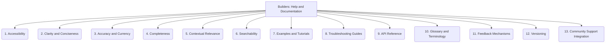

# Builders: Tooling and Scripts - Help and Documentation - 13-Fold Division

This document applies a 13-fold division to the 'Help and Documentation' facet of 'Tooling and Scripts' under the 'Builders' archetype, providing a deeper level of granularity for understanding and improving help resources.

## 1. Accessibility

Ease of finding, navigating, and accessing help resources, including their discoverability within the tool and external platforms.

## 2. Clarity and Conciseness

How easy it is to understand the information provided, ensuring it is free from jargon, ambiguity, and unnecessary verbosity.

## 3. Accuracy and Currency

Ensuring the information is correct, up-to-date, and reflects the current state and functionality of the tool.

## 4. Completeness

Covering all necessary topics, features, use cases, and potential scenarios, leaving no critical gaps in information.

## 5. Contextual Relevance

Providing help that is specific and directly applicable to the user's current task, situation, or error message, minimizing cognitive load.

## 6. Searchability

How easily users can find specific information within the documentation through effective indexing, keywords, and search functionalities.

## 7. Examples and Tutorials

Providing practical demonstrations, code snippets, and step-by-step guides to illustrate usage and facilitate learning.

## 8. Troubleshooting Guides

Offering clear, actionable solutions to common problems, frequently asked questions, and explanations of error messages.

## 9. API Reference

Detailed descriptions of functions, classes, methods, and interfaces, including their parameters, return values, and behaviors.

## 10. Glossary and Terminology

Defining key terms, concepts, and acronyms used in the tool and its documentation, ensuring a shared understanding.

## 11. Feedback Mechanisms

Ways for users to provide suggestions, report issues, or ask questions about the documentation, fostering continuous improvement.

## 12. Versioning

How documentation is aligned with and reflects different versions or releases of the tool, ensuring users access relevant information.

## 13. Community Support Integration

Linking to forums, chat channels, issue trackers, or other community resources where users can seek additional help or engage with peers.

---

## Visual Representation (Mermaid Diagram)

