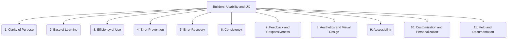

# Builders: Tooling and Scripts - Usability and UX - 11-Fold Division

This document applies an 11-fold division to the 'Usability and UX' facet of 'Tooling and Scripts' under the 'Builders' archetype, providing a deeper level of granularity for understanding user experience.

## 1. Clarity of Purpose

How well the tool's function, capabilities, and intended use are communicated to the user, ensuring immediate understanding.

## 2. Ease of Learning

The effort required for a new user to become proficient with the tool, including its interface, features, and workflows.

## 3. Efficiency of Use

How quickly and effectively experienced users can accomplish tasks with the tool, minimizing unnecessary steps or cognitive load.

## 4. Error Prevention

Design choices and mechanisms that minimize the likelihood of user mistakes, guiding them towards correct actions.

## 5. Error Recovery

How easily users can correct errors, undo actions, and recover from problems or unexpected situations within the tool.

## 6. Consistency

Uniformity in design, language, behavior, and interaction patterns across the tool's various components and features.

## 7. Feedback and Responsiveness

How the tool communicates its state, progress, and responses to user actions, providing timely and clear indications.

## 8. Aesthetics and Visual Design

The visual appeal, layout, and overall pleasantness of the tool's interface, contributing to user satisfaction.

## 9. Accessibility

Design considerations and features that ensure the tool can be effectively used by individuals with diverse abilities and needs.

## 10. Customization and Personalization

The ability for users to tailor the tool's appearance, settings, or behavior to their individual preferences or workflows.

## 11. Help and Documentation

The availability, quality, and discoverability of in-tool assistance, tutorials, and external documentation to support users.

---

## Visual Representation (Mermaid Diagram)

