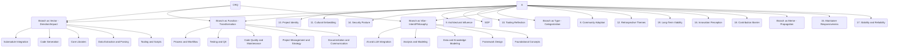

```mermaid
graph TD
    E5("Data Extraction and Parsing")
    C("SOP")
    P("15. Maintainer Responsiveness")
    O("14. Security Posture")
    F3("Code Quality and Maintenance")
    E3("Submodule Integration")
    G("Branch as Type - Categorization")
    F1("Process and Workflow")
    F5("Project Management and Strategy")
    D2("Framework Design")
    B("CRQ")
    R("17. Stability and Reliability")
    D4("AI and LLM Integration")
    F("Branch as Function - Transformation")
    K("10. Tooling Reflection")
    E("Branch as Vector - Direction/Impact")
    F4("Testing and QA")
    N("13. Project Identity")
    D1("Foundational Concepts")
    Q("16. Innovation Perception")
    E2("Tooling and Scripts")
    D("Branch as Vibe - Intent/Philosophy")
    E1("Core Libraries")
    T("19. Long-Term Viability")
    J("9. Architectural Influence")
    D3("Data and Knowledge Modeling")
    D5("Analysis and Modeling")
    S("18. Contribution Barrier")
    I("8. Community Adoption")
    M("12. Retrospective Themes")
    F2("Documentation and Communication")
    E4("Code Generation")
    L("11. Cultural Embedding")
    H("Branch as Meme - Propagation")
    D --> D4
    F --> F1
    A --> E
    D --> D5
    A --> N
    A --> L
    B --> F
    E --> E3
    A --> F
    A --> O
    B --> E
    A --> J
    A --> C
    A --> K
    E --> E4
    F --> F4
    F --> F3
    A --> G
    A --> D
    D --> D3
    F --> F5
    A --> I
    B --> D
    A --> M
    D --> D2
    A --> T
    D --> D1
    E --> E1
    E --> E5
    A --> Q
    A --> S
    A --> H
    E --> E2
    A --> P
    F --> F2
    A --> R
```