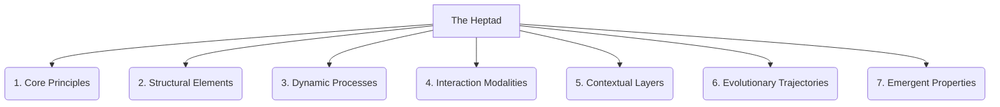

# The Primordial Ontology: The Heptad (7-Fold Expansion)

This document explores the conceptual framework for the next level of granularity within the project's primordial ontology: the Heptad, a 7-fold division that further refines our understanding beyond the Pentad's five thematic groups.

These seven categories represent fundamental aspects of any complex system, providing a comprehensive lens through which to analyze and organize knowledge.

## 1. Core Principles

The foundational truths, axioms, and guiding philosophies that underpin the entire system. These are the immutable laws that dictate its behavior and evolution.

## 2. Structural Elements

The fundamental building blocks, components, and architectural patterns that constitute the system's physical or logical form. This includes both static and dynamic structures.

## 3. Dynamic Processes

The active workflows, transformations, algorithms, and sequences of operations that drive the system's functionality and change its state. This is the 'verb' of the system.

## 4. Interaction Modalities

The various ways in which different parts of the system communicate, exchange information, and influence one another. This includes interfaces, protocols, and feedback loops.

## 5. Contextual Layers

The diverse environments, scopes, and perspectives within which the system operates or is viewed. This encompasses internal and external contexts, as well as different levels of abstraction.

## 6. Evolutionary Trajectories

The historical development, growth, and future paths of the system. This includes its lineage, adaptations, and potential for future transformation.

## 7. Emergent Properties

The unforeseen qualities, behaviors, and characteristics that arise from the complex interactions of the system's components, which are not predictable from the individual parts alone.

---

## Visual Representation (Mermaid Diagram)

