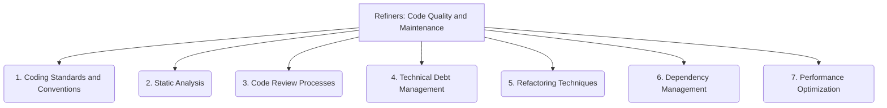

# Refiners: Code Quality and Maintenance - 7-Fold Division

This document applies the 7-fold division of the Heptad to the 'Code Quality and Maintenance' thematic group under the 'Refiners' archetype, providing a deeper level of granularity for improving code quality and ensuring long-term maintainability.

## 1. Coding Standards and Conventions

Establishing clear rules and guidelines for code style, formatting, naming, and structure to ensure consistency and readability across the codebase.

## 2. Static Analysis

Utilizing automated tools to analyze source code without executing it, identifying potential issues, bugs, vulnerabilities, and deviations from coding standards.

## 3. Code Review Processes

Implementing peer review mechanisms to scrutinize code for quality, correctness, efficiency, security, and adherence to established guidelines before integration.

## 4. Technical Debt Management

Strategies and practices for identifying, prioritizing, tracking, and systematically addressing accumulated technical debt within the project.

## 5. Refactoring Techniques

Methods and approaches for restructuring existing code without changing its external behavior, aiming to improve its design, readability, and maintainability.

## 6. Dependency Management

Ensuring that external libraries, frameworks, and components are properly managed, kept up-to-date, secure, and compatible with the project's requirements.

## 7. Performance Optimization

Identifying and improving areas of code that impact system performance, resource consumption, and overall efficiency, often through profiling and targeted enhancements.

---

## Visual Representation (Mermaid Diagram)

