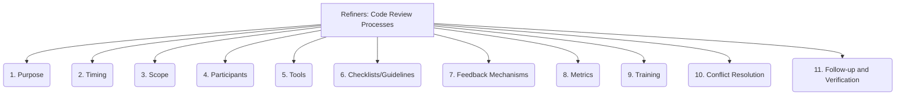

# Refiners: Code Quality and Maintenance - Code Review Processes - 11-Fold Division

This document applies an 11-fold division to the 'Code Review Processes' facet of 'Code Quality and Maintenance' under the 'Refiners' archetype, providing a deeper level of granularity for how code is reviewed to ensure quality.

## 1. Purpose

The primary goals and objectives of the code review (e.g., bug detection, knowledge sharing, quality assurance, adherence to standards).

## 2. Timing

When reviews occur within the development lifecycle (e.g., pre-commit, post-commit, before merge, continuous).

## 3. Scope

What is included in the review (e.g., entire pull request, specific files, architectural changes, security implications).

## 4. Participants

Who is involved in the review process (e.g., peers, leads, dedicated reviewers, cross-functional teams).

## 5. Tools

Software and platforms used to facilitate reviews (e.g., GitHub/GitLab PR features, dedicated code review tools, IDE integrations).

## 6. Checklists/Guidelines

Structured criteria, best practices, or checklists to ensure comprehensive and consistent reviews.

## 7. Feedback Mechanisms

How comments, suggestions, approvals, and rejections are communicated and tracked within the review process.

## 8. Metrics

Quantifiable measures of review effectiveness (e.g., defects found per review, review time, code coverage impact).

## 9. Training

Educating developers on how to conduct effective, constructive, and respectful code reviews.

## 10. Conflict Resolution

How disagreements or differing opinions during reviews are handled, discussed, and resolved to reach consensus.

## 11. Follow-up and Verification

Ensuring that feedback is addressed, changes are implemented correctly, and the review's objectives are met before final approval.

---

## Visual Representation (Mermaid Diagram)

