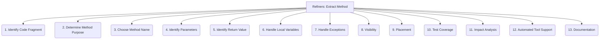

# Refiners: Code Quality and Maintenance - Extract Method - 13-Fold Division

This document applies a 13-fold division to the 'Extract Method' facet of 'Refactoring Techniques' under the 'Refiners' archetype, providing a deeper level of granularity for turning a code fragment into a new method.

## 1. Identify Code Fragment

Pinpointing the specific lines or block of code that performs a single, well-defined responsibility and should be extracted.

## 2. Determine Method Purpose

Clearly defining what the new method will do, its single responsibility, and its intended outcome.

## 3. Choose Method Name

Selecting a descriptive, concise, and action-oriented name for the new method that accurately reflects its purpose.

## 4. Identify Parameters

Determining what data (variables, objects) from the original context needs to be passed into the new method as arguments.

## 5. Identify Return Value

Determining what data (if any) the new method needs to return to the original calling context.

## 6. Handle Local Variables

Managing local variables used within the extracted fragment, deciding if they become parameters, return values, or remain internal to the new method.

## 7. Handle Exceptions

Ensuring proper exception handling within the new method and how exceptions are propagated or managed in the calling context.

## 8. Visibility

Deciding the appropriate access level (e.g., private, protected, public) for the new method based on its intended usage.

## 9. Placement

Where the new method should be located (e.g., within the same class, in a new utility class, or a different existing class).

## 10. Test Coverage

Ensuring the extracted method is adequately covered by existing unit tests, or writing new tests if necessary, to maintain correctness.

## 11. Impact Analysis

Assessing the potential effects of the extraction on other parts of the codebase, including callers, dependencies, and performance.

## 12. Automated Tool Support

Utilizing IDE features or specialized refactoring tools to perform the extraction automatically, reducing manual errors and ensuring correctness.

## 13. Documentation

Adding comments, docstrings, or other forms of documentation to the new method, explaining its purpose, parameters, and return value.

---

## Visual Representation (Mermaid Diagram)

