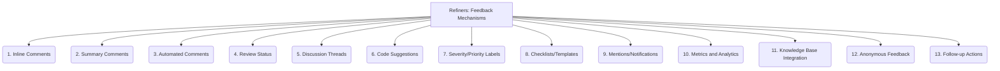

# Refiners: Code Quality and Maintenance - Feedback Mechanisms - 13-Fold Division

This document applies a 13-fold division to the 'Feedback Mechanisms' facet of 'Code Review Processes' under the 'Refiners' archetype, providing a deeper level of granularity for how comments, suggestions, and approvals are communicated during code review.

## 1. Inline Comments

Direct comments on specific lines or blocks of code, allowing for precise and contextual feedback.

## 2. Summary Comments

Overall feedback provided at the pull request level, summarizing key points, general impressions, or architectural concerns.

## 3. Automated Comments

Feedback generated by linters, static analysis tools, or CI/CD pipelines, flagging issues automatically.

## 4. Review Status

Clear indication of approval, rejection, or changes requested, providing a high-level overview of the review's outcome.

## 5. Discussion Threads

Allowing for back-and-forth conversations and replies on specific comments or points of feedback, fostering collaborative problem-solving.

## 6. Code Suggestions

Providing direct code edits or alternative implementations within the review tool, making it easier for the author to apply changes.

## 7. Severity/Priority Labels

Categorizing feedback based on its importance or urgency (e.g., critical, major, minor, suggestion) to guide the author's focus.

## 8. Checklists/Templates

Guiding reviewers to provide structured and comprehensive feedback, ensuring all relevant aspects are covered.

## 9. Mentions/Notifications

Alerting relevant individuals (e.g., code author, other reviewers) to new comments, updates, or specific requests for attention.

## 10. Metrics and Analytics

Tracking feedback patterns, response times, resolution rates, and other metrics to identify areas for process improvement.

## 11. Knowledge Base Integration

Linking feedback to documentation, coding standards, or best practices in a knowledge base for easy reference and learning.

## 12. Anonymous Feedback

Allowing reviewers to provide feedback without revealing their identity (if desired), potentially encouraging more candid comments.

## 13. Follow-up Actions

Clearly defining next steps for addressing feedback, including who is responsible and by when, ensuring accountability.

---

## Visual Representation (Mermaid Diagram)

