# Refiners: Code Quality and Maintenance - Inline Comments - 17-Fold Division

This document applies a 17-fold division to the 'Inline Comments' facet of 'Feedback Mechanisms' under the 'Refiners' archetype, providing a deeper level of granularity for how specific feedback is provided directly within code during reviews.

## 1. Placement

Where comments are located relative to the code (e.g., on the same line, above a block, at the end of a function, file header).

## 2. Granularity

The scope of the comment, ranging from a single character or token to an entire function or class definition.

## 3. Purpose

The reason for the comment (e.g., asking a question, suggesting an alternative, pointing out a bug, requesting clarification, appreciating good code).

## 4. Tone

The emotional quality or attitude conveyed by the comment (e.g., constructive, critical, appreciative, neutral, humorous).

## 5. Clarity

How easy it is to understand the comment's meaning, avoiding ambiguity, jargon, or overly complex phrasing.

## 6. Conciseness

The brevity of the comment, conveying the message effectively with the fewest necessary words.

## 7. Actionability

Whether the comment clearly indicates what needs to be done, if anything, by the code author.

## 8. Contextual Relevance

How well the comment relates directly to the specific code it's attached to, ensuring it's not out of place.

## 9. Code Examples

Including small code snippets or pseudocode within the comment to illustrate a suggested change or a problematic pattern.

## 10. References

Linking to external documentation, coding standards, design principles, or relevant issues/tickets for more context.

## 11. Mentions/Tags

Directly addressing specific individuals or teams within the comment to ensure they are notified and can respond.

## 12. Resolution Status

Tracking whether the comment has been addressed, resolved, or dismissed by the code author, and the reason for the action.

## 13. Discussion Threads

Allowing for replies, follow-up questions, and back-and-forth conversations directly on a specific inline comment.

## 14. Automated Suggestions

Comments generated by tools (e.g., linters, static analyzers, AI code review bots) that provide automated feedback.

## 15. Severity/Priority

Indicating the importance or urgency of the comment (e.g., critical, major, minor, suggestion) to guide the author's focus.

## 16. Best Practices

Adherence to established guidelines for writing effective inline comments, promoting consistency and quality in feedback.

## 17. Impact on Code

How the comment influences or leads to specific changes, refactorings, or improvements in the underlying code.

---

## Visual Representation (Mermaid Diagram)

```mermaid
graph TD
    A[Refiners: Inline Comments] --> B(1. Placement)
    A --> C(2. Granularity)
    A --> D(3. Purpose)
    A --> E(4. Tone)
    A --> F(5. Clarity)
    A --> G(6. Conciseness)
    A --> H(7. Actionability)
    A --> I(8. Contextual Relevance)
    A --> J(9. Code Examples)
    A --> K(10. References)
    A --> L(11. Mentions/Tags)
    A --> M(12. Resolution Status)
    A --> N(13. Discussion Threads)
    A --> O(14. Automated Suggestions)
    A --> P(15. Severity/Priority)
    A --> Q(16. Best Practices)
    A --> R(17. Impact on Code)
```

