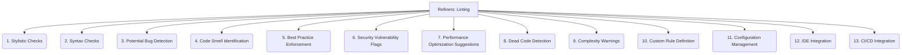

# Refiners: Code Quality and Maintenance - Linting - 13-Fold Division

This document applies a 13-fold division to the 'Linting' facet of 'Static Analysis' under the 'Refiners' archetype, providing a deeper level of granularity for identifying stylistic issues, potential errors, and non-idiomatic code.

## 1. Stylistic Checks

Enforcing code formatting, naming conventions, whitespace rules, and other aesthetic aspects of the codebase.

## 2. Syntax Checks

Identifying grammatical errors in the code that prevent compilation or correct interpretation by the language parser.

## 3. Potential Bug Detection

Flagging suspicious code patterns that might lead to runtime errors, unexpected behavior, or logical flaws.

## 4. Code Smell Identification

Recognizing patterns that indicate underlying design problems, poor practices, or potential future issues, even if they are not immediate bugs.

## 5. Best Practice Enforcement

Guiding developers to follow recommended coding patterns, idioms, and architectural principles for the specific language or framework.

## 6. Security Vulnerability Flags

Highlighting code that could be exploited, such as insecure API usage, improper input validation, or potential injection points.

## 7. Performance Optimization Suggestions

Suggesting more efficient ways to write code, use data structures, or implement algorithms to improve runtime performance.

## 8. Dead Code Detection

Identifying unreachable code, unused variables, functions, or classes that can be safely removed to reduce complexity.

## 9. Complexity Warnings

Alerting to overly complex functions, classes, or modules based on metrics like cyclomatic complexity or nesting depth.

## 10. Custom Rule Definition

Allowing project-specific rules to be defined and enforced, tailoring linting to unique requirements or domain-specific patterns.

## 11. Configuration Management

How linting rules are defined, shared, version-controlled, and managed across a project or organization (e.g., `.eslintrc`, `tslint.json`).

## 12. IDE Integration

Providing real-time feedback, warnings, errors, and automatic fixes directly within the Integrated Development Environment (IDE).

## 13. CI/CD Integration

Automating linting checks as part of the continuous integration and continuous delivery pipelines to ensure code quality before merging.

---

## Visual Representation (Mermaid Diagram)

