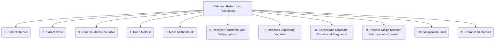

# Refiners: Code Quality and Maintenance - Refactoring Techniques - 11-Fold Division

This document applies an 11-fold division to the 'Refactoring Techniques' facet of 'Code Quality and Maintenance' under the 'Refiners' archetype, providing a deeper level of granularity for systematically restructuring existing code without changing its external behavior.

## 1. Extract Method

Turning a code fragment into a new method, improving readability and reusability.

## 2. Extract Class

Moving a cohesive set of fields and methods into a new class, often to address a large class or to improve single responsibility.

## 3. Rename Method/Variable

Changing the name of a method, variable, class, or field to better reflect its purpose, improving clarity and understanding.

## 4. Inline Method

Replacing a method call with the body of the method, often used when a method's body is as clear as its name.

## 5. Move Method/Field

Moving a method or field to a more appropriate class, typically the one it uses most or is most related to.

## 6. Replace Conditional with Polymorphism

Using polymorphism to handle different cases instead of complex `if/else` or `switch` statements, leading to more extensible code.

## 7. Introduce Explaining Variable

Creating a temporary variable to make a complex expression or a series of operations more readable and understandable.

## 8. Consolidate Duplicate Conditional Fragments

Combining identical code blocks that appear in different branches of a conditional statement, reducing duplication.

## 9. Replace Magic Number with Symbolic Constant

Replacing literal numbers or strings with named constants, improving readability and maintainability.

## 10. Encapsulate Field

Making a public field private and providing accessor (getter/setter) methods, controlling access and protecting data integrity.

## 11. Composed Method

Breaking down a large, complex method into smaller, more focused methods, each performing a single, well-defined step.

---

## Visual Representation (Mermaid Diagram)

