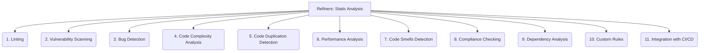

# Refiners: Code Quality and Maintenance - Static Analysis - 11-Fold Division

This document applies an 11-fold division to the 'Static Analysis' facet of 'Code Quality and Maintenance' under the 'Refiners' archetype, providing a deeper level of granularity for utilizing automated tools to identify potential issues in code.

## 1. Linting

Identifying stylistic issues, potential errors, and non-idiomatic code patterns that do not necessarily cause crashes but can reduce readability or maintainability.

## 2. Vulnerability Scanning

Detecting known security flaws, weaknesses, or vulnerabilities (e.g., SQL injection, XSS, buffer overflows) in the codebase.

## 3. Bug Detection

Finding common programming errors, logical flaws, or runtime issues (e.g., null pointer dereferences, uninitialized variables, resource leaks) without executing the code.

## 4. Code Complexity Analysis

Measuring metrics like cyclomatic complexity, cognitive complexity, or nesting depth to identify overly complex code sections that are hard to understand and maintain.

## 5. Code Duplication Detection

Identifying identical or very similar code blocks that appear in multiple places, indicating opportunities for refactoring and reducing maintenance effort.

## 6. Performance Analysis

Pinpointing potential performance bottlenecks, inefficient algorithms, or resource-intensive operations in the code.

## 7. Code Smells Detection

Identifying patterns in code that indicate underlying design problems, poor practices, or potential future issues, as defined by common code smell taxonomies.

## 8. Compliance Checking

Ensuring adherence to internal coding standards, industry regulations (e.g., HIPAA, PCI DSS), or specific project guidelines.

## 9. Dependency Analysis

Analyzing external and internal dependencies for vulnerabilities, licensing issues, or compatibility problems.

## 10. Custom Rules

Defining and implementing project-specific rules for static analysis to enforce unique coding standards or detect domain-specific issues.

## 11. Integration with CI/CD

Automating static analysis within the continuous integration and continuous delivery pipelines to provide early and continuous feedback on code quality.

---

## Visual Representation (Mermaid Diagram)

