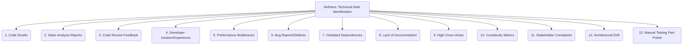

# Refiners: Code Quality and Maintenance - Technical Debt Identification - 13-Fold Division

This document applies a 13-fold division to the 'Identification' facet of 'Technical Debt Management' under the 'Refiners' archetype, providing a deeper level of granularity for recognizing and documenting technical debt.

## 1. Code Smells

Recognizing patterns in code that, while not bugs, indicate underlying design problems, poor practices, or potential future issues.

## 2. Static Analysis Reports

Utilizing automated tools (linters, code analyzers) to flag potential issues, violations of coding standards, or areas of high complexity.

## 3. Code Review Feedback

Identifying technical debt through comments, suggestions, and discussions during peer code reviews, highlighting areas for improvement.

## 4. Developer Intuition/Experience

Leveraging the tacit knowledge and insights of experienced developers who can intuitively sense where the debt lies based on past projects.

## 5. Performance Bottlenecks

Pinpointing areas of code that are inefficient, slow, or consume excessive resources, often revealed through profiling or monitoring.

## 6. Bug Reports/Defects

Analyzing recurring bugs, critical defects, or frequent regressions that point to systemic issues, design flaws, or brittle code.

## 7. Outdated Dependencies

Identifying libraries, frameworks, or external components that are no longer maintained, have known vulnerabilities, or are significantly behind current versions.

## 8. Lack of Documentation

Recognizing areas where understanding, usage, or maintenance is hindered by missing, incomplete, or poor-quality documentation.

## 9. High Churn Areas

Identifying parts of the codebase that are frequently changed, modified, or cause regressions, indicating instability or poor design.

## 10. Complexity Metrics

Using quantitative measures (e.g., cyclomatic complexity, coupling, cohesion) to highlight overly complex or intertwined code sections.

## 11. Stakeholder Complaints

Listening to feedback from users, product owners, or business stakeholders about system limitations, difficulties, or unmet needs that stem from technical debt.

## 12. Architectural Drift

Recognizing deviations from the intended system architecture, often leading to increased complexity, reduced maintainability, and future problems.

## 13. Manual Testing Pain Points

Identifying areas of the system that are difficult, time-consuming, or error-prone to test manually, often indicating a lack of automated tests or poor testability.

---

## Visual Representation (Mermaid Diagram)

