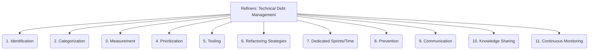

# Refiners: Code Quality and Maintenance - Technical Debt Management - 11-Fold Division

This document applies an 11-fold division to the 'Technical Debt Management' facet of 'Code Quality and Maintenance' under the 'Refiners' archetype, providing a deeper level of granularity for how projects manage and reduce technical debt.

## 1. Identification

Methods for recognizing and documenting technical debt, including code smells, outdated libraries, design flaws, or insufficient test coverage.

## 2. Categorization

Classifying technical debt by type (e.g., design debt, code debt, documentation debt, testing debt) and assessing its impact on the project.

## 3. Measurement

Quantifying the cost, effort, or risk associated with technical debt, often using metrics like lines of code affected, complexity, or estimated rework time.

## 4. Prioritization

Deciding which technical debt to address first based on its business value, risk, impact on development velocity, and strategic alignment.

## 5. Tooling

Utilizing static analysis tools, linters, code quality platforms, or specialized technical debt management software to assist in identification and tracking.

## 6. Refactoring Strategies

Approaches to systematically reduce technical debt without changing external behavior, such as extracting methods, simplifying logic, or improving architecture.

## 7. Dedicated Sprints/Time

Allocating specific resources, time, or dedicated sprints for technical debt repayment, ensuring it is addressed proactively rather than reactively.

## 8. Prevention

Practices and guidelines implemented to avoid accumulating new technical debt, including clear coding standards, thorough code reviews, and robust testing.

## 9. Communication

Transparently discussing technical debt with stakeholders, explaining its impact on project timelines, costs, and quality, and building consensus for repayment.

## 10. Knowledge Sharing

Documenting technical debt, its root causes, and implemented solutions to prevent recurrence, educate the team, and foster a culture of quality.

## 11. Continuous Monitoring

Regularly reassessing the state of technical debt, its impact on the project's health, and the effectiveness of repayment efforts.

---

## Visual Representation (Mermaid Diagram)

