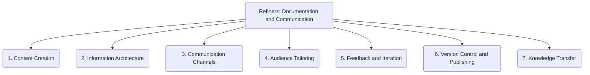

# Refiners: Documentation and Communication - 7-Fold Division

This document applies the 7-fold division of the Heptad to the 'Documentation and Communication' thematic group under the 'Refiners' archetype, providing a deeper level of granularity for improving documentation and communication practices.

## 1. Content Creation

The process of generating clear, concise, accurate, and relevant documentation, including technical specifications, user guides, and API references.

## 2. Information Architecture

Organizing documentation for easy navigation, discoverability, and logical flow, ensuring users can quickly find the information they need.

## 3. Communication Channels

The various platforms, tools, and methods used for information exchange within the project, such as meetings, chat, email, and forums.

## 4. Audience Tailoring

Adapting the content, style, and level of detail of documentation and communication to suit different user groups and their specific needs.

## 5. Feedback and Iteration

Establishing mechanisms for collecting input, reviewing suggestions, and continuously improving documentation and communication strategies.

## 6. Version Control and Publishing

Managing changes to documentation, ensuring version consistency, and making it accessible through appropriate publishing platforms.

## 7. Knowledge Transfer

Strategies and practices for effectively sharing information, expertise, and lessons learned within the team and across the project.

---

## Visual Representation (Mermaid Diagram)

