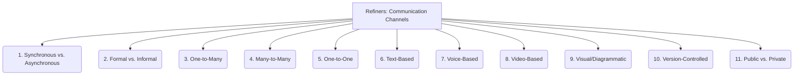

# Refiners: Documentation and Communication - Communication Channels - 11-Fold Division

This document applies an 11-fold division to the 'Communication Channels' facet of 'Documentation and Communication' under the 'Refiners' archetype, providing a deeper level of granularity for the various platforms and methods used for information exchange.

## 1. Synchronous vs. Asynchronous

Distinguishing between real-time communication (e.g., live meetings, instant messaging) and time-delayed communication (e.g., email, documentation).

## 2. Formal vs. Informal

Categorizing communication based on its level of formality, from structured, official announcements to casual, spontaneous interactions.

## 3. One-to-Many

Channels designed for broadcasting information from a single source to a large audience (e.g., newsletters, announcements, public presentations).

## 4. Many-to-Many

Channels facilitating collaborative discussions and information exchange among groups of individuals (e.g., forums, chat rooms, wikis).

## 5. One-to-One

Direct communication between two individuals (e.g., direct messages, private emails, phone calls).

## 6. Text-Based

Communication primarily through written words (e.g., chat, email, documentation, written reports).

## 7. Voice-Based

Communication through spoken words (e.g., phone calls, voice chat, podcasts, verbal instructions).

## 8. Video-Based

Communication involving visual and auditory elements (e.g., video conferences, screen sharing, recorded demonstrations).

## 9. Visual/Diagrammatic

Communication primarily through diagrams, charts, flowcharts, or other visual models to convey complex information concisely.

## 10. Version-Controlled

Communication that is stored and tracked within version control systems (e.g., Git comments, Pull Request descriptions, issue comments).

## 11. Public vs. Private

Whether the communication is accessible to everyone (e.g., public forums, open-source documentation) or restricted to a specific group (e.g., internal team chat, private emails).

---

## Visual Representation (Mermaid Diagram)

