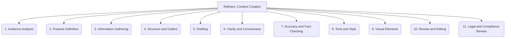

# Refiners: Documentation and Communication - Content Creation - 11-Fold Division

This document applies an 11-fold division to the 'Content Creation' facet of 'Documentation and Communication' under the 'Refiners' archetype, providing a deeper level of granularity for generating clear, concise, and accurate documentation.

## 1. Audience Analysis

Understanding the target readers, their technical background, needs, and goals to tailor the content appropriately.

## 2. Purpose Definition

Clearly stating the objective of the documentation (e.g., to instruct, to inform, to troubleshoot) to guide content development.

## 3. Information Gathering

Collecting all necessary data, facts, details, and insights from various sources (e.g., code, interviews, existing documents).

## 4. Structure and Outline

Organizing content logically before writing, creating a clear hierarchy, headings, and flow for the document.

## 5. Drafting

Writing the initial version of the content, focusing on conveying the core message and information.

## 6. Clarity and Conciseness

Ensuring the language is easy to understand, free from jargon, and to the point, avoiding unnecessary verbosity.

## 7. Accuracy and Fact-Checking

Verifying the correctness of all information, data, and technical details presented in the documentation.

## 8. Tone and Style

Maintaining a consistent voice, tone, and writing style throughout the documentation, aligning with project guidelines.

## 9. Visual Elements

Incorporating diagrams, screenshots, flowcharts, code examples, and other visual aids to enhance understanding and engagement.

## 10. Review and Editing

Proofreading, refining, and improving the content for grammar, spelling, punctuation, clarity, and overall quality.

## 11. Legal and Compliance Review

Ensuring the documentation adheres to legal requirements, industry standards, and internal compliance policies (e.g., privacy, licensing).

---

## Visual Representation (Mermaid Diagram)

