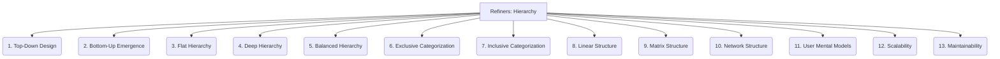

# Refiners: Documentation and Communication - Hierarchy - 13-Fold Division

This document applies a 13-fold division to the 'Hierarchy' facet of 'Information Architecture' under the 'Refiners' archetype, providing a deeper level of granularity for organizing content in a logical, tree-like structure.

## 1. Top-Down Design

Starting with broad categories and progressively breaking them down into more specific sub-categories and individual topics.

## 2. Bottom-Up Emergence

Allowing categories and relationships to emerge organically from the content itself, often through tagging or clustering.

## 3. Flat Hierarchy

Minimal levels of categorization, where most content is accessible within one or two clicks from the top level.

## 4. Deep Hierarchy

Many levels of nested categories, providing granular organization but potentially requiring more clicks to reach specific content.

## 5. Balanced Hierarchy

Striking a good balance between breadth (number of items at each level) and depth (number of levels) to optimize navigation.

## 6. Exclusive Categorization

Each item belongs to only one specific category, ensuring clear placement and avoiding ambiguity.

## 7. Inclusive Categorization

Items can belong to multiple categories, allowing for different pathways to discover the same content.

## 8. Linear Structure

Content organized in a sequential flow, often used for tutorials, step-by-step guides, or narratives.

## 9. Matrix Structure

Content organized along multiple dimensions or facets, allowing users to filter and explore based on various criteria.

## 10. Network Structure

Content connected through non-linear relationships, often represented as a web of interconnected nodes, emphasizing associations.

## 11. User Mental Models

Aligning the hierarchy with how users naturally think about and categorize information, making it intuitive and easy to predict.

## 12. Scalability

How well the hierarchy accommodates growth in content volume and complexity without becoming unwieldy or difficult to navigate.

## 13. Maintainability

The ease of updating, reorganizing, and managing the hierarchy as content evolves or new information is added.

---

## Visual Representation (Mermaid Diagram)

