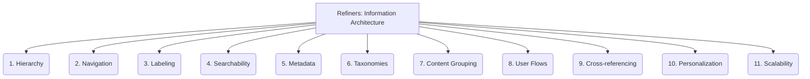

# Refiners: Documentation and Communication - Information Architecture - 11-Fold Division

This document applies an 11-fold division to the 'Information Architecture' facet of 'Documentation and Communication' under the 'Refiners' archetype, providing a deeper level of granularity for organizing documentation for easy navigation and discoverability.

## 1. Hierarchy

Organizing content in a logical, tree-like structure, from broad categories to specific topics, to reflect relationships and dependencies.

## 2. Navigation

Designing intuitive ways for users to move through the documentation, including menus, breadcrumbs, and internal links.

## 3. Labeling

Using clear, consistent, and descriptive names for categories, sections, links, and other navigational elements.

## 4. Searchability

Optimizing content for effective search and discoverability, including keyword optimization, search engine integration, and faceted search.

## 5. Metadata

Adding descriptive tags, attributes, and properties to content for better organization, filtering, and retrieval.

## 6. Taxonomies

Creating controlled vocabularies, classification systems, and tagging structures to categorize and relate content consistently.

## 7. Content Grouping

Deciding how individual pieces of content are clustered together into logical units, sections, or modules.

## 8. User Flows

Mapping the typical paths users take to find information or complete tasks within the documentation, optimizing for common use cases.

## 9. Cross-referencing

Linking related content across different sections or documents to provide comprehensive information and facilitate deeper understanding.

## 10. Personalization

Tailoring information presentation or content recommendations based on user roles, preferences, or past behavior.

## 11. Scalability

Designing an architecture that can accommodate growth in content volume, complexity, and user base without compromising usability.

---

## Visual Representation (Mermaid Diagram)

