# Refiners: Documentation and Communication - Real-time Interaction - 17-Fold Division

This document applies a 17-fold division to the 'Real-time Interaction' facet of 'Synchronous vs. Asynchronous' under the 'Refiners' archetype, providing a deeper level of granularity for immediate, live exchange of information.

## 1. Verbal Communication

Spoken words exchanged in meetings, phone calls, voice chat, or direct conversations, allowing for immediate vocal cues.

## 2. Non-Verbal Cues

Body language, facial expressions, gestures, and tone of voice that convey additional meaning beyond spoken words.

## 3. Shared Screens/Documents

Collaborating on visual content simultaneously, such as reviewing code, documents, or presentations in real-time.

## 4. Instant Messaging

Text-based, immediate exchange of short messages, often used for quick questions, updates, or informal discussions.

## 5. Whiteboarding/Drawing

Collaborative visual brainstorming, diagramming, or sketching ideas in real-time, either physically or digitally.

## 6. Live Coding/Pair Programming

Real-time collaborative code development where two or more individuals work on the same codebase simultaneously.

## 7. Immediate Feedback

Instant responses to questions, suggestions, or actions, allowing for rapid iteration and clarification.

## 8. Spontaneity

Unplanned, ad-hoc interactions that arise naturally from the flow of work, often leading to quick problem resolution.

## 9. Problem-Solving

Rapid iteration and resolution of issues, bugs, or design challenges through direct, collaborative discussion.

## 10. Relationship Building

Fostering rapport, trust, and personal connections among team members through direct and frequent interaction.

## 11. Conflict Resolution

Addressing disagreements or misunderstandings directly and immediately, often leading to faster and more effective resolutions.

## 12. Decision-Making

Reaching consensus and making decisions quickly through live discussions and immediate feedback.

## 13. Brainstorming

Generating ideas collaboratively in real-time, leveraging the immediate exchange of thoughts and concepts.

## 14. Crisis Management

Rapid response, coordination, and information exchange during critical situations or emergencies.

## 15. On-the-Fly Clarification

Immediately resolving ambiguities, misunderstandings, or questions as they arise, preventing misinterpretations.

## 16. Emotional Connection

Conveying empathy, understanding, and support through direct interaction, building stronger team bonds.

## 17. Contextual Richness

The ability to convey a wide range of information, including non-verbal cues, tone, and immediate context, leading to deeper understanding.

---

## Visual Representation (Mermaid Diagram)

```mermaid
graph TD
    A[Refiners: Real-time Interaction] --> B(1. Verbal Communication)
    A --> C(2. Non-Verbal Cues)
    A --> D(3. Shared Screens/Documents)
    A --> E(4. Instant Messaging)
    A --> F(5. Whiteboarding/Drawing)
    A --> G(6. Live Coding/Pair Programming)
    A --> H(7. Immediate Feedback)
    A --> I(8. Spontaneity)
    A --> J(9. Problem-Solving)
    A --> K(10. Relationship Building)
    A --> L(11. Conflict Resolution)
    A --> M(12. Decision-Making)
    A --> N(13. Brainstorming)
    A --> O(14. Crisis Management)
    A --> P(15. On-the-Fly Clarification)
    A --> Q(16. Emotional Connection)
    A --> R(17. Contextual Richness)
```

