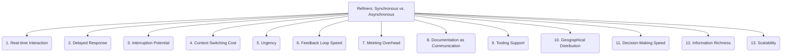

# Refiners: Documentation and Communication - Synchronous vs. Asynchronous - 13-Fold Division

This document applies a 13-fold division to the 'Synchronous vs. Asynchronous' facet of 'Communication Channels' under the 'Refiners' archetype, providing a deeper level of granularity for understanding real-time vs. time-delayed communication.

## 1. Real-time Interaction

Immediate, live exchange of information where participants are present and responsive simultaneously (e.g., face-to-face meetings, live chat).

## 2. Delayed Response

Communication where a response is not expected immediately, allowing participants to engage at their own pace (e.g., email, forum posts, documentation).

## 3. Interruption Potential

How much the communication mode disrupts current tasks or workflows, with synchronous modes generally having higher interruption potential.

## 4. Context Switching Cost

The overhead (time and mental effort) involved in shifting focus between tasks due to incoming communication, often higher for synchronous interruptions.

## 5. Urgency

How quickly information needs to be conveyed or acted upon, influencing the choice between immediate (synchronous) and delayed (asynchronous) channels.

## 6. Feedback Loop Speed

How rapidly feedback can be given and received, with synchronous channels offering instant clarification and iteration.

## 7. Meeting Overhead

The time and effort involved in scheduling, preparing for, conducting, and following up on synchronous meetings.

## 8. Documentation as Communication

Utilizing written records, wikis, or knowledge bases for asynchronous information sharing, ensuring persistence and searchability.

## 9. Tooling Support

Different tools and platforms optimized for synchronous (e.g., video conferencing, instant messaging) versus asynchronous (e.g., project management software, email) communication.

## 10. Geographical Distribution

Impact of time zones and physical distance on the feasibility and effectiveness of synchronous communication, often favoring asynchronous for distributed teams.

## 11. Decision-Making Speed

How quickly decisions can be made and finalized in each mode, with synchronous often enabling faster consensus but potentially less thoughtful input.

## 12. Information Richness

The amount of non-verbal cues, tone, and immediate context conveyed, which is typically higher in synchronous communication.

## 13. Scalability

How well the communication mode supports increasing team size, project complexity, or information volume without becoming inefficient or overwhelming.

---

## Visual Representation (Mermaid Diagram)

