# Refiners: Documentation and Communication - User Mental Models - 17-Fold Division

This document applies a 17-fold division to the 'User Mental Models' facet of 'Hierarchy' under the 'Refiners' archetype, providing a deeper level of granularity for understanding how users perceive and interact with information systems.

## 1. Prior Experience

How users' past interactions with similar systems, software, or real-world objects influence their expectations and understanding of a new system.

## 2. Domain Knowledge

The user's understanding of the subject matter or specific field related to the system, impacting their interpretation of information.

## 3. Task Goals

What the user is trying to achieve or accomplish when interacting with the system, guiding their actions and information seeking.

## 4. Cognitive Biases

Systematic errors in thinking that can affect user behavior, decision-making, and interpretation of information (e.g., confirmation bias, availability heuristic).

## 5. Cultural Background

How cultural norms, conventions, and societal values shape user expectations, preferences, and understanding of design elements.

## 6. Language and Terminology

The words, phrases, and technical terms users are familiar with, influencing their comprehension of labels, instructions, and content.

## 7. Conceptual Mapping

How users connect abstract concepts, system functionalities, or data structures to concrete interface elements and interactions.

## 8. Feedback Interpretation

How users understand system responses, error messages, progress indicators, and other forms of feedback, and what actions they take based on them.

## 9. Navigation Strategies

The typical methods users employ to explore, browse, and find information within a system (e.g., searching, browsing, direct access).

## 10. Problem-Solving Approaches

The mental methods and strategies users employ to overcome challenges, resolve issues, or achieve goals within the system.

## 11. Expectations of Functionality

What users believe the system is capable of doing, based on its design, marketing, or prior experience.

## 12. Trust and Credibility

How users perceive the reliability, authority, and trustworthiness of the system and the information it provides.

## 13. Emotional Responses

How the system's design, performance, or interactions evoke feelings in users (e.g., frustration, delight, confusion).

## 14. Learning Styles

How users prefer to acquire new information or skills (e.g., visual, auditory, kinesthetic), influencing documentation and tutorial design.

## 15. Attention Span

The typical duration users can focus on a task or piece of information, impacting content chunking and interaction design.

## 16. Memory Limitations

How users process, store, and recall information, influencing the design of memory aids and consistent interfaces.

## 17. Decision-Making Processes

How users evaluate options, weigh pros and cons, and make choices within the system, influencing interaction flows.

---

## Visual Representation (Mermaid Diagram)

```mermaid
graph TD
    A[Refiners: User Mental Models] --> B(1. Prior Experience)
    A --> C(2. Domain Knowledge)
    A --> D(3. Task Goals)
    A --> E(4. Cognitive Biases)
    A --> F(5. Cultural Background)
    A --> G(6. Language and Terminology)
    A --> H(7. Conceptual Mapping)
    A --> I(8. Feedback Interpretation)
    A --> J(9. Navigation Strategies)
    A --> K(10. Problem-Solving Approaches)
    A --> L(11. Expectations of Functionality)
    A --> M(12. Trust and Credibility)
    A --> N(13. Emotional Responses)
    A --> O(14. Learning Styles)
    A --> P(15. Attention Span)
    A --> Q(16. Memory Limitations)
    A --> R(17. Decision-Making Processes)
```

