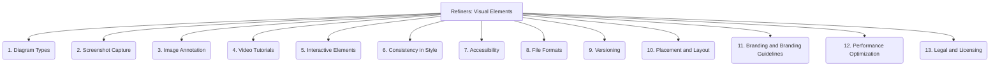

# Refiners: Documentation and Communication - Visual Elements - 13-Fold Division

This document applies a 13-fold division to the 'Visual Elements' facet of 'Content Creation' under the 'Refiners' archetype, providing a deeper level of granularity for incorporating visual aids into documentation.

## 1. Diagram Types

Utilizing various types of diagrams (e.g., flowcharts, sequence diagrams, architecture diagrams, UML) to illustrate processes, systems, or relationships.

## 2. Screenshot Capture

Tools and techniques for capturing clear, relevant, and high-quality screenshots of user interfaces or system outputs.

## 3. Image Annotation

Adding callouts, highlights, arrows, and explanatory text to images and screenshots for enhanced clarity and focus.

## 4. Video Tutorials

Creating short video guides, screencasts, or animated explanations for complex procedures or concepts.

## 5. Interactive Elements

Incorporating clickable diagrams, embedded simulations, code editors, or other interactive components to engage users.

## 6. Consistency in Style

Maintaining a uniform visual style, color palette, typography, and iconography across all diagrams and images for a cohesive look.

## 7. Accessibility

Ensuring visual content is accessible to users with disabilities, including providing alternative text (alt text) for images and captions for videos.

## 8. File Formats

Choosing appropriate image (e.g., PNG, SVG, JPEG) and video (e.g., MP4, WebM) file formats for optimal quality, performance, and compatibility.

## 9. Versioning

Managing different versions of visual assets, ensuring they align with corresponding documentation and product versions.

## 10. Placement and Layout

Strategically positioning visuals within the text, using appropriate spacing and captions, for optimal understanding and readability.

## 11. Branding and Branding Guidelines

Adhering to project or company branding guidelines for visual elements, including logos, colors, and fonts.

## 12. Performance Optimization

Optimizing image and video file sizes, resolutions, and loading strategies for faster page loading and improved user experience.

## 13. Legal and Licensing

Ensuring proper licensing, attribution, and copyright compliance for all visual assets, especially those sourced externally.

---

## Visual Representation (Mermaid Diagram)

