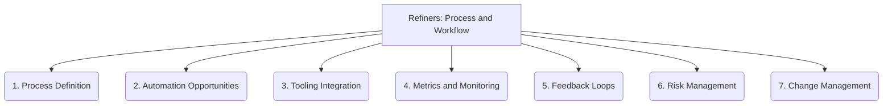

# Refiners: Process and Workflow - 7-Fold Division

This document applies the 7-fold division of the Heptad to the 'Process and Workflow' thematic group under the 'Refiners' archetype, providing a deeper level of granularity for improving development processes and workflows.

## 1. Process Definition

Clearly outlining the steps, roles, responsibilities, inputs, and outputs within a workflow, ensuring clarity and consistency.

## 2. Automation Opportunities

Identifying tasks or steps within a process that can be automated to improve efficiency, reduce manual effort, and minimize errors.

## 3. Tooling Integration

How various tools, platforms, and systems are incorporated into the workflow to support its execution, data flow, and communication.

## 4. Metrics and Monitoring

Defining key performance indicators (KPIs) and establishing mechanisms to track progress, identify bottlenecks, and assess the effectiveness of the workflow.

## 5. Feedback Loops

Establishing mechanisms for continuous improvement, allowing for the collection of feedback, analysis of results, and adaptation of the workflow.

## 6. Risk Management

Identifying potential bottlenecks, failures, security vulnerabilities, or deviations within the process and planning mitigation strategies.

## 7. Change Management

The structured process for introducing, communicating, implementing, and validating changes to existing workflows, ensuring smooth transitions.

---

## Visual Representation (Mermaid Diagram)

