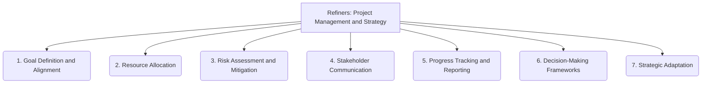

# Refiners: Project Management and Strategy - 7-Fold Division

This document applies the 7-fold division of the Heptad to the 'Project Management and Strategy' thematic group under the 'Refiners' archetype, providing a deeper level of granularity for how projects are managed and strategic decisions are made.

## 1. Goal Definition and Alignment

Clearly articulating project goals, objectives, and key results, and ensuring all efforts are aligned to contribute to their achievement.

## 2. Resource Allocation

Managing and optimizing the deployment of personnel, budget, time, and other resources to maximize project efficiency and effectiveness.

## 3. Risk Assessment and Mitigation

Identifying potential threats, uncertainties, and challenges that could impact project success, and developing strategies to minimize their likelihood or impact.

## 4. Stakeholder Communication

Effectively engaging, informing, and managing the expectations of all parties involved in or affected by the project, ensuring transparency and collaboration.

## 5. Progress Tracking and Reporting

Monitoring project status, milestones, and deliverables, and providing regular, accurate updates to stakeholders on performance and deviations.

## 6. Decision-Making Frameworks

Establishing clear processes, criteria, and responsibilities for making informed and timely project decisions, ensuring accountability.

## 7. Strategic Adaptation

Adjusting project plans, goals, and approaches in response to changing circumstances, new insights, market shifts, or unforeseen challenges, ensuring long-term relevance.

---

## Visual Representation (Mermaid Diagram)

