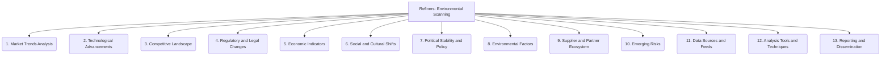

# Refiners: Project Management and Strategy - Environmental Scanning - 13-Fold Division

This document applies a 13-fold division to the 'Environmental Scanning' facet of 'Strategic Adaptation' under the 'Refiners' archetype, providing a deeper level of granularity for how projects monitor their external environment.

## 1. Market Trends Analysis

Monitoring shifts in customer preferences, demand patterns, industry growth, and emerging market segments to identify opportunities and threats.

## 2. Technological Advancements

Tracking new tools, platforms, scientific breakthroughs, and disruptive technologies that could impact the project's technical landscape or competitive position.

## 3. Competitive Landscape

Analyzing competitor strategies, product offerings, market positioning, strengths, and weaknesses to understand the competitive environment.

## 4. Regulatory and Legal Changes

Keeping abreast of new laws, policies, compliance requirements, and legal precedents that could affect the project's operations or deliverables.

## 5. Economic Indicators

Monitoring macroeconomic factors such as inflation rates, interest rates, GDP growth, employment figures, and consumer spending for their potential influence.

## 6. Social and Cultural Shifts

Understanding changes in demographics, lifestyle trends, values, consumer behavior, and public opinion that might impact project relevance or adoption.

## 7. Political Stability and Policy

Assessing government stability, upcoming elections, policy changes, and geopolitical events that could create opportunities or risks.

## 8. Environmental Factors

Considering climate change impacts, resource availability, sustainability concerns, and ecological regulations relevant to the project's domain.

## 9. Supplier and Partner Ecosystem

Evaluating the health, reliability, and performance of the supply chain, key vendors, and strategic partners.

## 10. Emerging Risks

Identifying unforeseen threats, 'black swan' events, or low-probability, high-impact scenarios that could significantly disrupt the project.

## 11. Data Sources and Feeds

Establishing reliable channels, subscriptions, and methods for continuous information gathering from diverse external sources.

## 12. Analysis Tools and Techniques

Utilizing software, methodologies, and analytical frameworks for processing, interpreting, and deriving insights from scanned environmental data.

## 13. Reporting and Dissemination

Communicating findings, insights, and recommendations from environmental scanning to relevant stakeholders in a timely and actionable manner.

---

## Visual Representation (Mermaid Diagram)

