# Refiners: Project Management and Strategy - Ethical Implications - 19-Fold Division

This document applies a 19-fold division to the 'Ethical Implications' facet of 'Technological Advancements' under the 'Refiners' archetype, providing a deeper level of granularity for considering the ethical dimensions of technology.

## 1. Bias and Fairness

Addressing algorithmic bias, ensuring equitable outcomes, and preventing discrimination in technological systems and their applications.

## 2. Privacy and Data Protection

Safeguarding personal and sensitive information, ensuring data security, and respecting individual privacy rights in data collection and use.

## 3. Accountability and Responsibility

Assigning liability for decisions and actions made by autonomous systems or technologies, and defining clear lines of responsibility.

## 4. Transparency and Explainability

Making AI and technological processes, decisions, and outputs understandable, interpretable, and auditable to human users and stakeholders.

## 5. Human Autonomy and Control

Ensuring technology augments, rather than diminishes, human agency, decision-making, and control over their lives and work.

## 6. Job Displacement and Economic Impact

Addressing the societal and economic effects of automation and advanced technology on employment, income inequality, and labor markets.

## 7. Misinformation and Disinformation

Combating the spread of false or misleading content, particularly that generated or amplified by AI and digital platforms.

## 8. Security and Malicious Use

Preventing the misuse of technology for harmful purposes, including cyberattacks, surveillance, and autonomous weapons.

## 9. Environmental Impact

Assessing the energy consumption, carbon footprint, and ecological consequences of large-scale AI systems and technological infrastructure.

## 10. Digital Divide

Addressing inequalities in access to, and benefits from, technology, ensuring equitable participation in the digital world.

## 11. Intellectual Property and Copyright

Navigating complex issues of ownership, attribution, and fair use related to AI-generated content and the data used for training models.

## 12. Human-AI Collaboration

Defining ethical boundaries, best practices, and design principles for effective and responsible human-AI interaction and teamwork.

## 13. Societal Values Alignment

Ensuring technology development and deployment align with broader societal norms, cultural values, and human rights principles.

## 14. Regulatory Frameworks

Contributing to the development of effective, adaptive, and ethical governance, policies, and laws for emerging technologies.

## 15. Long-Term Societal Impact

Considering the profound, long-term effects of advanced technology and AI on human society, culture, and civilization.

## 16. Informed Consent

Ensuring individuals have a clear understanding of, and voluntarily agree to, how their data is collected, used, and shared by technological systems.

## 17. Vulnerable Populations

Protecting and empowering marginalized, disadvantaged, or at-risk groups in technological contexts, preventing exacerbation of existing inequalities.

## 18. Algorithmic Discrimination

Preventing technology from perpetuating or exacerbating social inequalities, biases, or unfair treatment through automated decision-making.

## 19. Future of Humanity

Reflecting on the existential questions, opportunities, and challenges posed by advanced technology and artificial intelligence for the long-term trajectory of human existence.

---

## Visual Representation (Mermaid Diagram)

```mermaid
graph TD
    A[Refiners: Ethical Implications] --> B(1. Bias and Fairness)
    A --> C(2. Privacy and Data Protection)
    A --> D(3. Accountability and Responsibility)
    A --> E(4. Transparency and Explainability)
    A --> F(5. Human Autonomy and Control)
    A --> G(6. Job Displacement and Economic Impact)
    A --> H(7. Misinformation and Disinformation)
    A --> I(8. Security and Malicious Use)
    A --> J(9. Environmental Impact)
    A --> K(10. Digital Divide)
    A --> L(11. Intellectual Property and Copyright)
    A --> M(12. Human-AI Collaboration)
    A --> N(13. Societal Values Alignment)
    A --> O(14. Regulatory Frameworks)
    A --> P(15. Long-Term Societal Impact)
    A --> Q(16. Informed Consent)
    A --> R(17. Vulnerable Populations)
    A --> S(18. Algorithmic Discrimination)
    A --> T(19. Future of Humanity)
```

