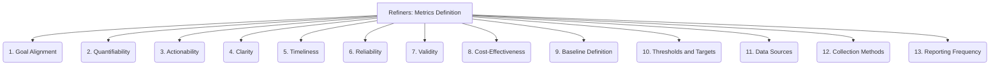

# Refiners: Project Management and Strategy - Metrics Definition - 13-Fold Division

This document applies a 13-fold division to the 'Metrics Definition' facet of 'Progress Tracking and Reporting' under the 'Refiners' archetype, providing a deeper level of granularity for identifying key performance indicators and other relevant measures.

## 1. Goal Alignment

Ensuring metrics directly support and contribute to the achievement of project goals, objectives, and strategic outcomes.

## 2. Quantifiability

Metrics must be measurable and expressed numerically, allowing for objective tracking and comparison.

## 3. Actionability

Metrics should provide insights that lead to concrete actions, decisions, or adjustments in project execution.

## 4. Clarity

Metrics should be easy to understand, interpret, and communicate by all stakeholders, regardless of their technical background.

## 5. Timeliness

Data for metrics should be available when needed for decision-making, reflecting the current state of the project.

## 6. Reliability

Metrics should consistently produce accurate and repeatable results, minimizing errors or inconsistencies in data collection.

## 7. Validity

Metrics should truly measure what they are intended to measure, providing a true reflection of the underlying performance or quality.

## 8. Cost-Effectiveness

The effort and resources required to collect, process, and report metrics should be justified by the value they provide.

## 9. Baseline Definition

Establishing a starting point, historical data, or initial state for comparison, to measure progress or change over time.

## 10. Thresholds and Targets

Defining acceptable ranges, warning levels, or desired values for metrics, indicating performance expectations.

## 11. Data Sources

Identifying where the raw data for each metric will come from (e.g., project management tools, code repositories, test results, financial systems).

## 12. Collection Methods

How data for metrics will be gathered (e.g., automated scripts, manual input, API integrations, surveys).

## 13. Reporting Frequency

How often each metric will be calculated, analyzed, and reported to stakeholders (e.g., daily, weekly, monthly, quarterly).

---

## Visual Representation (Mermaid Diagram)

