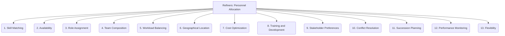

# Refiners: Project Management and Strategy - Personnel Allocation - 13-Fold Division

This document applies a 13-fold division to the 'Personnel Allocation' facet of 'Resource Allocation' under the 'Refiners' archetype, providing a deeper level of granularity for assigning team members to tasks and roles.

## 1. Skill Matching

Assigning individuals based on their expertise, required skills, and experience relevant to the task or project needs.

## 2. Availability

Considering the current workload, capacity, and scheduled commitments of team members to ensure realistic assignments.

## 3. Role Assignment

Defining specific roles, responsibilities, and accountability for each individual within the project structure.

## 4. Team Composition

Balancing diverse skills, experience levels, personalities, and perspectives to create effective and cohesive teams.

## 5. Workload Balancing

Distributing tasks equitably among team members to prevent burnout, optimize productivity, and ensure fair treatment.

## 6. Geographical Location

Considering time zones, physical proximity, and remote work arrangements for effective collaboration and communication.

## 7. Cost Optimization

Allocating personnel to minimize project costs while maintaining the required quality and efficiency, considering salary, benefits, and overhead.

## 8. Training and Development

Assigning tasks or roles that contribute to skill growth, career development, and cross-training opportunities for team members.

## 9. Stakeholder Preferences

Considering requests or preferences from project stakeholders, clients, or management for specific personnel or teams.

## 10. Conflict Resolution

Addressing disagreements, competition, or disputes over personnel resources, ensuring fair and effective solutions.

## 11. Succession Planning

Identifying and developing backups or successors for critical roles to ensure continuity and mitigate key person risk.

## 12. Performance Monitoring

Tracking individual and team performance against allocated tasks, goals, and project milestones to assess effectiveness and provide feedback.

## 13. Flexibility

Adapting personnel assignments, roles, and team structures as project needs evolve, priorities shift, or unforeseen challenges arise.

---

## Visual Representation (Mermaid Diagram)

