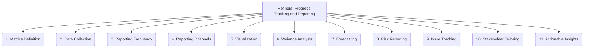

# Refiners: Project Management and Strategy - Progress Tracking and Reporting - 11-Fold Division

This document applies an 11-fold division to the 'Progress Tracking and Reporting' facet of 'Project Management and Strategy' under the 'Refiners' archetype, providing a deeper level of granularity for monitoring project status and communicating updates.

## 1. Metrics Definition

Identifying key performance indicators (KPIs), progress metrics, and other relevant measures to track project health and performance.

## 2. Data Collection

Gathering data on task completion, resource usage, budget consumption, quality metrics, and other relevant project parameters.

## 3. Reporting Frequency

How often progress reports are generated and distributed (e.g., daily stand-ups, weekly status reports, monthly reviews, quarterly summaries).

## 4. Reporting Channels

How reports are distributed and consumed (e.g., dashboards, email, formal presentations, project management software, wikis).

## 5. Visualization

Presenting data in clear and understandable charts, graphs, or tables to convey information effectively.

## 6. Variance Analysis

Comparing actual progress against planned progress.

## 7. Forecasting

Predicting future project performance based on current trends and historical data.

## 8. Risk Reporting

Communicating risk status and mitigation status.

## 9. Issue Tracking)

Monitoring and reporting on project issues and their resolution.

## 10. Stakeholder Tailoring

Customizing reports for different stakeholder groups.

## 11. Actionable Insights

Providing recommendations or next steps based on reported data.

---

## Visual Representation (Mermaid Diagram)

