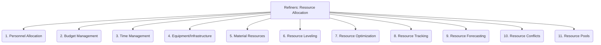

# Refiners: Project Management and Strategy - Resource Allocation - 11-Fold Division

This document applies an 11-fold division to the 'Resource Allocation' facet of 'Project Management and Strategy' under the 'Refiners' archetype, providing a deeper level of granularity for managing and optimizing the deployment of project resources.

## 1. Personnel Allocation

Assigning team members to tasks, roles, or projects based on their skills, availability, and project requirements.

## 2. Budget Management

Distributing financial resources across different project activities, phases, or components to ensure efficient spending.

## 3. Time Management

Allocating specific timeframes, deadlines, and effort estimates to tasks and activities within the project schedule.

## 4. Equipment/Infrastructure

Provisioning and managing necessary hardware, software, licenses, development environments, and other technological tools.

## 5. Material Resources

Managing physical materials, supplies, or consumables required for project execution.

## 6. Resource Leveling

Adjusting resource schedules to avoid over-allocation or under-utilization, smoothing out resource demand over time.

## 7. Resource Optimization

Maximizing the efficiency and effectiveness of resource use, aiming to achieve project goals with minimal waste.

## 8. Resource Tracking

Monitoring and recording resource consumption, availability, and utilization against planned allocations.

## 9. Resource Forecasting

Predicting future resource needs.

## 10. Resource Conflicts

Identifying and resolving situations where resources are overbooked.

## 11. Resource Pools

Managing shared resources across multiple projects.

---

## Visual Representation (Mermaid Diagram)

