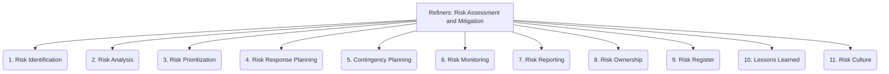

# Refiners: Project Management and Strategy - Risk Assessment and Mitigation - 11-Fold Division

This document applies an 11-fold division to the 'Risk Assessment and Mitigation' facet of 'Project Management and Strategy' under the 'Refiners' archetype, providing a deeper level of granularity for identifying and managing project risks.

## 1. Risk Identification

Proactively discovering potential risks that could impact the project, including technical, financial, operational, external, and strategic risks.

## 2. Risk Analysis

Evaluating the likelihood (probability) of identified risks occurring and their potential impact (consequences) on project objectives.

## 3. Risk Prioritization

Ranking risks based on their severity, probability, and potential impact, to focus resources on the most critical threats.

## 4. Risk Response Planning

Developing strategies and actions to address identified risks (e.g., avoid, mitigate, transfer, accept, exploit).

## 5. Contingency Planning

Preparing fallback plans or alternative courses of action for high-impact risks that cannot be fully mitigated.

## 6. Risk Monitoring

Continuously tracking identified risks, new emerging risks, and the effectiveness of implemented mitigation strategies.

## 7. Risk Reporting

Communicating risk status, potential impacts, and mitigation efforts to relevant stakeholders in a clear and timely manner.

## 8. Risk Ownership

Assigning clear responsibility for managing specific risks to individuals or teams, ensuring accountability.

## 9. Risk Register

Maintaining a centralized log or database of all identified risks, their analysis, response plans, owners, and current status.

## 10. Lessons Learned

Documenting insights, successes, and failures from past risk management activities to improve future risk assessment and mitigation.

## 11. Risk Culture

Fostering an organizational environment where risk is openly discussed, proactively managed, and seen as an integral part of decision-making.

---

## Visual Representation (Mermaid Diagram)

